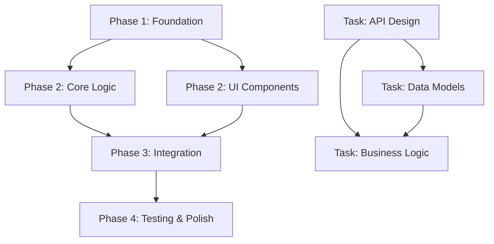

# Create PRD

## Feature file: $ARGUMENTS

Generate a complete PRD for general feature implementation with thorough research. Ensure context is passed to the AI agent to enable self-validation and iterative refinement. Read the feature file first to understand what needs to be created, how the examples provided help, and any other considerations.

The AI agent only gets the context you are appending to the PRD and training data. Assume the AI agent has access to the codebase and the same knowledge cutoff as you, so its important that your research findings are included or referenced in the PRD. The Agent has Websearch capabilities, so pass urls to documentation and examples.

## Research Process

1. **Codebase Analysis**
   - Search for similar features/patterns in the codebase
   - Identify files to reference in PRD
   - Note existing conventions to follow
   - Check test patterns for validation approach

2. **External Research**
   - Search for similar features/patterns online. If doing a web search, prefer to use the gemini cli web search tool before falling back to claude's web search tool.
   - Library documentation (include specific URLs). Make sure you use either the ref mcp server (preferable) or the context7 mcp server (fallback) for getting documentation on APIs, libraries, services, and code functions.
   - Implementation examples (GitHub/StackOverflow/blogs)
   - Best practices and common pitfalls

3. **User Clarification** (if needed)
   - Specific patterns to mirror and where to find them?
   - Integration requirements and where to find them?

## PRD Generation

### Critical Context to Include and pass to the AI agent as part of the PRD
- **Documentation**: URLs with specific sections. Make sure you use either the ref mcp server (preferable) or the context7 mcp server (fallback) for getting documentation on APIs, libraries, services, and code functions.
- **Code Examples**: Real snippets from codebase
- **Gotchas**: Library quirks, version issues
- **Patterns**: Existing approaches to follow

### Implementation Blueprint
- Start with pseudocode showing approach
- Reference real files for patterns
- Include error handling strategy
- Ensure code is properly documented using docstrings, inline comments, and updating README files

#### Phase-Based Implementation Strategy
- **Break down PRD into phases** with clearly defined deliverables
- **Identify parallelizable work** within and across phases
- **Create dependency graph** showing phase relationships
- **Design for multi-agent execution** where phases/tasks can be distributed to separate agents
- **Define clear handoff points** between phases with validation checkpoints

#### Phase Structure Template
Each phase should include:
- **Phase Name & Goal**: Clear objective and deliverable
- **Dependencies**: Which phases must complete before this one starts
- **Parallelization Opportunities**: Tasks within phase that can run concurrently
- **Agent Assignment Strategy**: How work could be distributed across multiple agents
- **Validation Criteria**: How to verify phase completion
- **Handoff Artifacts**: What gets passed to dependent phases

#### Dependency Graph Format
Include a visual dependency graph using Mermaid syntax:


#### Implementation Phases Template
```markdown
## Implementation Phases

### Phase 1: [Phase Name]
**Goal**: [Clear deliverable description]
**Dependencies**: None | [Previous phase names]
**Estimated Effort**: [Agent-days]
**Agent Assignment**: [Single/Multiple agents]

**Tasks**:
- [ ] **Task 1.1** (Parallelizable: Yes/No) - [Description]
- [ ] **Task 1.2** (Parallelizable: Yes/No) - [Description]
- [ ] **Task 1.3** (Parallelizable: Yes/No) - [Description]

**Parallelization Strategy**:
- Agent A: Tasks 1.1, 1.3
- Agent B: Task 1.2

**Validation Criteria**:
- [ ] [Specific check 1]
- [ ] [Specific check 2]

**Handoff Artifacts**:
- [File/component/interface descriptions]
- [Documentation updates]

---
[Repeat for each phase]
```

#### Multi-Agent Coordination Guidelines
- **Phase-level parallelization**: Independent phases can be assigned to different agents
- **Task-level parallelization**: Within a phase, independent tasks can be distributed
- **Synchronization points**: Clear checkpoints where agents must coordinate
- **Conflict resolution**: Strategy for handling overlapping file modifications
- **Communication protocol**: How agents share progress and coordinate handoffs

## Anti-Patterns to Avoid
- Don't create new patterns when existing ones work
- Don't skip validation because "it should work"  
- Don't ignore failing tests - fix them
- Don't use sync functions in async context
- Don't hardcode values that should be config
- Don't catch all exceptions - be specific

### Validation Gates (Must be Executable) eg for python
```bash
# Unit Tests
uv run pytest tests/ -v
```

*** CRITICAL AFTER YOU ARE DONE RESEARCHING AND EXPLORING THE CODEBASE BEFORE YOU START WRITING THE PRD ***

*** ULTRATHINK ABOUT THE PRD AND PLAN YOUR APPROACH THEN START WRITING THE PRD. BREAK DOWN THE PRD INTO PARALLELIZABLE PHASES WITH DEPENDENCY MAPPING. ***

**Key Planning Requirements**:
1. **Identify parallelizable work** - Which phases and tasks can run concurrently?
2. **Map dependencies clearly** - What must complete before other work can begin?
3. **Design for multi-agent execution** - How can the work be distributed across agents?
4. **Create visual dependency graph** - Use Mermaid syntax to show relationships
5. **Define coordination points** - Where do agents need to synchronize?

## Output
Save as: `prds/{next_highest_integer}_{feature_name}.md`, making the directory `prds/` if it does not exist.

## Quality Checklist
- [ ] All necessary context included
- [ ] Validation gates are executable by AI
- [ ] References existing patterns
- [ ] Clear implementation path
- [ ] Error handling documented
- [ ] **Dependency graph included** with Mermaid visualization
- [ ] **Phases clearly defined** with specific goals and deliverables
- [ ] **Parallelization opportunities identified** at phase and task level
- [ ] **Multi-agent coordination strategy** documented
- [ ] **Handoff artifacts specified** for each phase
- [ ] **Synchronization points defined** where coordination is needed

Score the PRD on a scale of 1-10 (confidence level to succeed in one-pass implementation using claude codes)

Remember: The goal is one-pass implementation success through comprehensive context.
