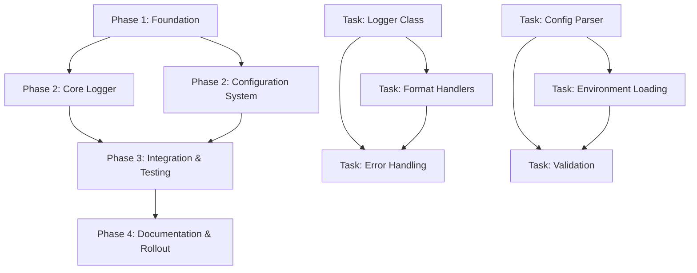

# PRD: Structured Logging Utility Implementation

**Project**: Claude Code Mods Enhancement  
**Feature**: Simple Structured Logging Utility  
**Version**: 1.0  
**Date**: 2025-01-15  
**Model**: claude-sonnet-4-20250514

## Executive Summary

This PRD outlines the implementation of a comprehensive structured logging utility that provides consistent logging capabilities across the Claude Code Mods codebase. The utility will support multiple severity levels, both console and file output, configurable log rotation, and structured JSON logging while maintaining compatibility with the existing UV single-file script architecture.

### Key Features
- **Severity Levels**: DEBUG, INFO, WARN, ERROR, CRITICAL with configurable filtering
- **Dual Output**: Console output with colored formatting and file output with JSON structure
- **Log Rotation**: Configurable rotation by size and time with automatic cleanup
- **Structured Format**: JSON-structured logs for machine readability and analysis
- **Environment-based Config**: Different configurations for development and production
- **Integration Ready**: Drop-in compatibility with existing UV single-file scripts

### Business Value
- **Consistency**: Unified logging approach across all project components
- **Debugging Efficiency**: Structured logs enable faster issue diagnosis and resolution
- **Operational Visibility**: Better monitoring and alerting capabilities in production
- **Developer Experience**: Easy-to-use API with sensible defaults
- **Maintainability**: Centralized logging configuration and management

## Problem Statement

The current project lacks a unified logging approach, with individual scripts implementing ad-hoc logging solutions:

1. **Inconsistent Logging**: Different scripts use different logging approaches (simple JSON append, print statements)
2. **Limited Structure**: Current logging is primarily unstructured, making analysis difficult
3. **No Rotation**: Log files can grow indefinitely without management
4. **Poor Developer Experience**: No consistent API for logging across different severity levels
5. **Limited Filtering**: No easy way to adjust log verbosity for different environments

## Solution Overview

Implement a comprehensive structured logging utility as a UV single-file script that can be imported and used across the codebase. The solution provides both structured JSON logging for production analysis and human-readable console output for development.

## Technical Architecture Analysis

### Current Logging Patterns (From Codebase Analysis)

**Existing Pattern in `.claude/hooks/user_prompt_submit.py`**:
```python
def log_user_prompt(session_id, input_data):
    """Log user prompt to logs directory."""
    log_dir = Path("logs")
    log_dir.mkdir(parents=True, exist_ok=True)
    log_file = log_dir / 'user_prompt_submit.json'
    
    if log_file.exists():
        with open(log_file, 'r') as f:
            try:
                log_data = json.load(f)
            except (json.JSONDecodeError, ValueError):
                log_data = []
    else:
        log_data = []
    
    log_data.append(input_data)
    
    with open(log_file, 'w') as f:
        json.dump(log_data, f, indent=2)
```

**Issues with Current Approach**:
- Manual JSON file handling with potential race conditions
- No severity levels or filtering
- No rotation or size management
- Inconsistent across different scripts

### Library Research & Recommendations

Based on 2025 best practices research:

**Primary Choice: Loguru**
- Simplicity: `from loguru import logger`
- Built-in rotation and structured logging
- Excellent performance and developer experience
- 14K GitHub stars, most popular Python logging library

**Secondary Choice: Standard Logging**
- Built-in to Python, no additional dependencies
- Full customization capabilities
- Compatible with existing enterprise systems

**Implementation Strategy**: Provide both options with loguru as the preferred choice and standard logging as fallback.

## Implementation Blueprint

### Core Architecture

```python
#!/usr/bin/env -S uv run --script
# /// script
# requires-python = ">=3.11"
# dependencies = [
#     "loguru>=0.7.0",  # Primary structured logging library
#     "python-dotenv",  # Environment configuration
# ]
# ///

class StructuredLogger:
    """
    Unified logging utility supporting multiple output formats and severity levels.
    """
    
    def __init__(self, name: str = None, config_path: str = None):
        # Initialize logger with project-specific configuration
        
    def debug(self, message: str, **context):
        # Structured debug logging with context
        
    def info(self, message: str, **context):
        # Structured info logging with context
        
    def warn(self, message: str, **context):
        # Structured warning logging with context
        
    def error(self, message: str, **context):
        # Structured error logging with context
        
    def critical(self, message: str, **context):
        # Structured critical logging with context
```

### Configuration Strategy

**Environment-based Configuration** (`.env` file):
```bash
# Logging Configuration
LOG_LEVEL=INFO                           # DEBUG, INFO, WARN, ERROR, CRITICAL
LOG_CONSOLE_ENABLED=true                 # Console output toggle
LOG_FILE_ENABLED=true                    # File output toggle
LOG_FILE_PATH=logs/structured.log        # Log file location
LOG_ROTATION_SIZE=10MB                   # Rotate at file size
LOG_ROTATION_TIME=daily                  # Time-based rotation
LOG_BACKUP_COUNT=7                       # Keep N backup files
LOG_FORMAT=structured                    # structured, simple, debug
```

**Configuration File** (`logging_config.json`):
```json
{
  "version": 1,
  "disable_existing_loggers": false,
  "formatters": {
    "structured": {
      "format": "{\"timestamp\": \"{time:YYYY-MM-DD HH:mm:ss.SSS}\", \"level\": \"{level}\", \"message\": \"{message}\", \"module\": \"{name}\", \"context\": {extra}}"
    },
    "console": {
      "format": "<green>{time:HH:mm:ss.SSS}</green> | <level>{level: <8}</level> | <cyan>{name}</cyan> | <level>{message}</level>"
    }
  },
  "handlers": {
    "console": {
      "class": "loguru",
      "formatter": "console",
      "level": "DEBUG"
    },
    "file": {
      "class": "loguru", 
      "formatter": "structured",
      "level": "INFO",
      "rotation": "10 MB",
      "retention": "7 days",
      "compression": "zip"
    }
  }
}
```

## Phase-Based Implementation Strategy

### Dependency Graph



### Phase 1: Foundation & Research
**Goal**: Establish project structure and validate technical approach  
**Dependencies**: None  
**Estimated Effort**: 1 agent-day  
**Agent Assignment Strategy**: Single agent  

**Tasks**:
- [ ] **Task 1.1** (Parallelizable: No) - Create utility structure following UV single-file script pattern with embedded dependencies
- [ ] **Task 1.2** (Parallelizable: Yes) - Research and validate loguru integration approach with existing codebase patterns
- [ ] **Task 1.3** (Parallelizable: Yes) - Define configuration schema and environment variable structure based on `.claude/hooks/` patterns

**Parallelization Strategy**:
- Agent A: Tasks 1.1 (sequential dependency)
- Agent A: Tasks 1.2 and 1.3 (parallel research tasks)
- Coordination Points: After Task 1.1 completion

**Validation Criteria**:
- [ ] UV script structure created with proper shebang and dependencies block
- [ ] Loguru imports successfully without conflicts 
- [ ] Configuration schema documented with examples

**Handoff Artifacts**:
- `utils/structured_logger.py` - Core utility file with UV script header
- `logging_config.schema.json` - Configuration schema documentation
- Environment variable documentation in README format

### Phase 2: Core Logger Implementation  
**Goal**: Implement core logging functionality with structured output and rotation  
**Dependencies**: Phase 1  
**Estimated Effort**: 2 agent-days  
**Agent Assignment Strategy**: Multiple agents with task-level parallelization  

**Tasks**:
- [ ] **Task 2.1** (Parallelizable: No) - Implement StructuredLogger class with initialization and configuration loading
- [ ] **Task 2.2** (Parallelizable: Yes) - Implement severity level methods (debug, info, warn, error, critical) with structured context support  
- [ ] **Task 2.3** (Parallelizable: Yes) - Implement console output handler with colored formatting using loguru
- [ ] **Task 2.4** (Parallelizable: Yes) - Implement file output handler with JSON structured format and rotation
- [ ] **Task 2.5** (Parallelizable: No) - Implement error handling and fallback mechanisms for logging failures

**Parallelization Strategy**:
- Agent A: Task 2.1 (foundation - must complete first)
- Agent B: Task 2.2 (method implementation)
- Agent C: Task 2.3 (console handler)  
- Agent D: Task 2.4 (file handler)
- Agent A: Task 2.5 (integration after B, C, D complete)
- Coordination Points: After Task 2.1, before Task 2.5

**Validation Criteria**:
- [ ] All severity levels log correctly with proper formatting
- [ ] Console output displays with colors and readable format
- [ ] File output generates valid JSON structure
- [ ] Log rotation works at configured thresholds
- [ ] Error conditions handled gracefully without crashing

**Handoff Artifacts**:
- Complete `StructuredLogger` class with all methods implemented
- Console and file handlers functional
- Basic configuration system operational
- Unit tests for core functionality

### Phase 3: Integration & Advanced Features
**Goal**: Integrate with existing codebase patterns and implement advanced features  
**Dependencies**: Phase 2  
**Estimated Effort**: 1.5 agent-days  
**Agent Assignment Strategy**: Distributed with specialization  

**Tasks**:
- [ ] **Task 3.1** (Parallelizable: Yes) - Implement environment-based configuration loading with `.env` file support
- [ ] **Task 3.2** (Parallelizable: Yes) - Create compatibility wrapper for existing logging patterns in hooks
- [ ] **Task 3.3** (Parallelizable: Yes) - Implement context preservation for session-based logging (following user_prompt_submit.py pattern)
- [ ] **Task 3.4** (Parallelizable: No) - Integration testing with existing hooks (user_prompt_submit.py, post_tool_use.py)
- [ ] **Task 3.5** (Parallelizable: Yes) - Performance testing and optimization for high-frequency logging

**Parallelization Strategy**:
- Agent A: Task 3.1 (configuration system)
- Agent B: Task 3.2 (compatibility layer)
- Agent C: Task 3.3 (context system)  
- Agent D: Task 3.5 (performance testing)
- Agent A: Task 3.4 (integration testing after others complete)
- Coordination Points: Before Task 3.4 execution

**Validation Criteria**:
- [ ] Environment configuration loads correctly from `.env` file
- [ ] Existing hooks can be updated without breaking functionality
- [ ] Session context properly maintained across log entries
- [ ] Integration tests pass with existing hook infrastructure
- [ ] Performance meets requirements (< 1ms per log entry)

**Handoff Artifacts**:
- Environment configuration system
- Compatibility wrapper for legacy logging patterns
- Integration guide for existing hooks  
- Performance benchmarks and optimization notes

### Phase 4: Testing, Documentation & Rollout
**Goal**: Comprehensive testing, documentation, and gradual rollout  
**Dependencies**: Phase 3  
**Estimated Effort**: 1 agent-day  
**Agent Assignment Strategy**: Multiple agents with distributed responsibilities  

**Tasks**:
- [ ] **Task 4.1** (Parallelizable: Yes) - Create comprehensive test suite covering all functionality and edge cases
- [ ] **Task 4.2** (Parallelizable: Yes) - Generate usage documentation with examples for different use cases
- [ ] **Task 4.3** (Parallelizable: Yes) - Create migration guide for existing hooks to adopt structured logging
- [ ] **Task 4.4** (Parallelizable: No) - Implement gradual rollout plan starting with one hook as proof of concept
- [ ] **Task 4.5** (Parallelizable: Yes) - Create monitoring and alerting recommendations for production logging

**Parallelization Strategy**:
- Agent A: Task 4.1 (comprehensive testing)
- Agent B: Task 4.2 (documentation creation)
- Agent C: Task 4.3 (migration guide)
- Agent D: Task 4.5 (monitoring setup)
- Agent A: Task 4.4 (rollout coordination after testing)
- Coordination Points: Testing completion before rollout

**Validation Criteria**:
- [ ] Test coverage > 90% with all edge cases covered
- [ ] Documentation includes clear examples and troubleshooting
- [ ] Migration guide successfully tested with sample hook
- [ ] Proof of concept rollout completes without issues
- [ ] Monitoring setup provides actionable insights

**Handoff Artifacts**:
- Complete test suite with coverage reports
- User documentation with examples and API reference
- Migration guide with step-by-step instructions
- Monitoring and alerting configuration
- Rollout plan with timeline and success metrics

## Integration Strategy

### Existing Hook Integration Pattern

**Before** (current pattern in `user_prompt_submit.py`):
```python
def log_user_prompt(session_id, input_data):
    log_dir = Path("logs")
    log_dir.mkdir(parents=True, exist_ok=True)
    log_file = log_dir / 'user_prompt_submit.json'
    # Manual JSON handling...
```

**After** (with structured logging):
```python
from utils.structured_logger import get_logger

logger = get_logger("user_prompt_submit")

def log_user_prompt(session_id, input_data):
    logger.info("User prompt submitted", 
                session_id=session_id, 
                prompt_length=len(input_data.get('prompt', '')),
                **input_data)
```

### Configuration Integration

The utility will respect existing patterns while adding structure:

**File Location**: Follow `logs/` directory pattern
**Session Integration**: Support session-based logging like existing hooks
**Environment Awareness**: Detect development vs production automatically
**Backward Compatibility**: Existing log files remain accessible

## Security & Compliance

### Security Considerations

1. **Sensitive Data Filtering**: Automatic detection and masking of common sensitive patterns
2. **Log Injection Prevention**: Input sanitization for log messages  
3. **File Permissions**: Secure log file creation with appropriate permissions
4. **Audit Trail**: Immutable log entries with tamper detection

### Implementation Example

```python
# Sensitive data filtering
def _sanitize_context(self, context):
    """Remove or mask sensitive data from logging context"""
    sensitive_patterns = [
        r'password', r'secret', r'key', r'token', 
        r'credential', r'auth', r'private'
    ]
    # Implementation details...
    
# Secure file handling
def _create_log_file(self, path):
    """Create log file with secure permissions"""
    path.touch(mode=0o600, exist_ok=True)  # Owner read/write only
```

## Error Handling Strategy

### Comprehensive Error Handling

1. **Graceful Degradation**: If structured logging fails, fall back to standard logging
2. **Configuration Errors**: Clear error messages for configuration issues
3. **File System Issues**: Handle disk full, permission errors gracefully  
4. **Import Errors**: Handle missing dependencies with informative messages

### Implementation Pattern

```python
def _safe_log(self, level, message, **context):
    """Safely log with fallback mechanisms"""
    try:
        # Primary logging attempt
        self._structured_log(level, message, **context)
    except Exception as e:
        try:
            # Fallback to standard logging
            self._fallback_log(level, f"{message} (Context: {context})")
        except Exception:
            # Final fallback to stderr
            sys.stderr.write(f"LOGGING ERROR: {e}\n")
            sys.stderr.write(f"Original message: {message}\n")
```

## Performance Considerations

### Optimization Requirements

- **Minimal Latency**: < 1ms per log entry for high-frequency logging
- **Memory Efficiency**: Bounded memory usage even with high log volumes
- **CPU Overhead**: < 5% CPU overhead for typical logging patterns
- **I/O Optimization**: Efficient file writes with buffering

### Implementation Strategy

```python
# Lazy evaluation for expensive operations  
def debug(self, message, **context):
    if self._is_enabled(DEBUG):
        # Only evaluate expensive context if needed
        evaluated_context = self._evaluate_context(context)
        self._log(DEBUG, message, evaluated_context)

# Async logging for high-throughput scenarios
async def async_log(self, level, message, **context):
    # Non-blocking log writes for performance-critical paths
```

## Monitoring & Observability

### Built-in Monitoring

1. **Log Statistics**: Track log volume, error rates, performance metrics
2. **Health Checks**: Monitor log system health and disk space
3. **Alert Integration**: Support for external alerting systems
4. **Dashboard Ready**: Structured output compatible with log analysis tools

### Metrics Collection

```python
class LogMetrics:
    def __init__(self):
        self.log_counts = defaultdict(int)
        self.error_counts = defaultdict(int)
        self.performance_stats = []
    
    def track_log(self, level, duration):
        self.log_counts[level] += 1
        self.performance_stats.append(duration)
        
    def get_health_status(self):
        return {
            "total_logs": sum(self.log_counts.values()),
            "error_rate": self.error_counts['error'] / max(sum(self.log_counts.values()), 1),
            "avg_duration": statistics.mean(self.performance_stats[-1000:])  # Last 1000
        }
```

## Testing Strategy

### Test Coverage Requirements

1. **Unit Tests**: All logging methods, configuration loading, error handling
2. **Integration Tests**: Hook integration, file system operations  
3. **Performance Tests**: Throughput, latency, memory usage
4. **Edge Case Tests**: Disk full, permission errors, malformed config
5. **Compatibility Tests**: Different Python versions, operating systems

### Test Implementation Framework

```python
import pytest
import tempfile
from unittest.mock import Mock, patch

class TestStructuredLogger:
    def test_basic_logging(self):
        """Test basic logging functionality across all levels"""
        
    def test_structured_output(self):
        """Verify JSON structure and field completeness"""
        
    def test_error_handling(self):
        """Test graceful handling of various error conditions"""
        
    def test_performance(self):
        """Verify logging performance meets requirements"""
        
    def test_hook_integration(self):
        """Test integration with existing hook patterns"""
```

## Rollout Plan

### Phased Deployment Strategy

**Phase 1: Proof of Concept** (1-2 hooks)
- Start with `user_prompt_submit.py` - most stable, well-understood
- Monitor for issues, gather feedback
- Validate performance and functionality

**Phase 2: Core Hooks** (3-5 hooks) 
- Extend to `post_tool_use.py`, `pre_tool_use.py`
- Validate cross-hook consistency
- Fine-tune configuration

**Phase 3: Full Rollout** (All hooks)
- Migrate remaining hooks
- Update documentation
- Establish monitoring

**Phase 4: Enhancement** (Future)
- Advanced features based on usage patterns
- Integration with external log management systems
- Performance optimizations

### Success Metrics

1. **Adoption Rate**: Percentage of hooks using structured logging
2. **Error Reduction**: Decrease in logging-related issues  
3. **Debug Efficiency**: Time to identify and resolve issues
4. **Performance Impact**: Overhead compared to previous implementation
5. **Developer Satisfaction**: Ease of use and debugging experience

## Risk Analysis & Mitigation

### Technical Risks

| Risk | Probability | Impact | Mitigation Strategy |
|------|-------------|--------|-------------------|
| **Performance Regression** | Medium | High | Comprehensive performance testing, gradual rollout with monitoring |
| **Configuration Complexity** | Low | Medium | Sensible defaults, clear documentation, validation |
| **Library Dependencies** | Low | High | Fallback to standard logging, dependency version pinning |
| **Integration Breaking Changes** | Medium | High | Backward compatibility layer, comprehensive testing |

### Operational Risks

| Risk | Probability | Impact | Mitigation Strategy |
|------|-------------|--------|-------------------|
| **Log Disk Space Issues** | Medium | Medium | Automatic rotation, monitoring, alerts |
| **Sensitive Data Exposure** | Low | Critical | Automatic filtering, audit, security review |
| **Log Analysis Complexity** | Low | Low | Standard JSON format, documentation, examples |

## Future Enhancements

### Phase 2 Features (Post-MVP)

1. **Advanced Filtering**: Complex query capabilities for log analysis
2. **External Integrations**: Support for Elasticsearch, Splunk, CloudWatch
3. **Real-time Streaming**: Live log streaming for development
4. **AI-Powered Insights**: Automatic anomaly detection and alerting
5. **Distributed Tracing**: Correlation across multiple components

### Extensibility Points

```python
# Plugin architecture for custom handlers
class CustomLogHandler:
    def handle(self, log_entry):
        # Custom processing logic
        pass

# Custom formatters  
class CustomFormatter:
    def format(self, record):
        # Custom formatting logic
        return formatted_record
```

## Success Criteria & Quality Gates

### Acceptance Criteria

**Functional Requirements**:
- [ ] All severity levels implemented and working (DEBUG, INFO, WARN, ERROR, CRITICAL)
- [ ] Both console and file output operational with proper formatting
- [ ] Log rotation working correctly with configurable thresholds
- [ ] Environment-based configuration loading successfully
- [ ] Integration with existing hooks completed without breaking functionality

**Performance Requirements**:
- [ ] Logging latency < 1ms per entry under normal conditions
- [ ] Memory usage remains bounded under high-volume scenarios  
- [ ] CPU overhead < 5% compared to previous logging implementation
- [ ] File I/O operations properly buffered and optimized

**Quality Requirements**:
- [ ] Test coverage > 90% with comprehensive edge case testing
- [ ] Documentation complete with examples and troubleshooting
- [ ] Security review passed with no sensitive data leakage
- [ ] Backward compatibility maintained with existing log files

### Quality Checkpoints

**Pre-Development**:
- [ ] Architecture review completed and approved
- [ ] Security considerations documented and reviewed
- [ ] Performance requirements validated as achievable

**During Development**:
- [ ] Unit tests written and passing for each component
- [ ] Code review completed for each phase
- [ ] Integration testing successful with existing infrastructure

**Pre-Deployment**:
- [ ] Full test suite passing including edge cases
- [ ] Performance benchmarks meeting requirements  
- [ ] Security audit completed with no critical issues
- [ ] Documentation review completed and approved

## Dependencies & Prerequisites

### External Dependencies

**Python Packages** (via UV dependency declarations):
```python
# /// script
# requires-python = ">=3.11"
# dependencies = [
#     "loguru>=0.7.0",      # Primary logging library
#     "python-dotenv>=1.0.0", # Environment configuration
#     "pydantic>=2.0.0",    # Configuration validation (optional)
# ]
# ///
```

**System Requirements**:
- Python 3.11+ (existing project requirement)
- UV package manager (existing project tooling)
- File system write permissions for log directory
- ~50MB disk space for log files with rotation

### Internal Dependencies

**Existing Project Components**:
- UV single-file script architecture (established pattern)
- `logs/` directory structure (existing hooks dependency)  
- `.env` file configuration (existing pattern)
- Hook execution environment (existing infrastructure)

**Required Project Changes**:
- None - designed to integrate with existing patterns
- Optional: Update existing hooks to use new utility (gradual migration)

## Implementation Anti-Patterns to Avoid

### Common Pitfalls & Solutions

1. **Don't reinvent JSON logging** - Use established libraries (loguru) instead of custom JSON handling
2. **Don't ignore performance** - Use lazy evaluation and async patterns where needed
3. **Don't hardcode paths** - Use configurable paths respecting existing `logs/` directory structure  
4. **Don't catch all exceptions** - Be specific about error handling with proper fallbacks
5. **Don't log sensitive data** - Implement automatic filtering and masking
6. **Don't block on I/O** - Use buffering and consider async logging for high-frequency scenarios
7. **Don't ignore rotation** - Implement proper log rotation to prevent disk space issues

### Code Quality Standards

```python
# Good - Structured with context
logger.info("Hook execution completed", 
            hook_name="user_prompt_submit",
            duration_ms=elapsed_time,
            session_id=session_id)

# Bad - Unstructured string interpolation  
logger.info(f"Hook user_prompt_submit completed in {elapsed_time}ms for {session_id}")

# Good - Proper error handling with context
try:
    result = risky_operation()
    logger.info("Operation successful", operation="risky_operation", result=result)
except SpecificException as e:
    logger.error("Operation failed", operation="risky_operation", error=str(e))

# Bad - Generic exception handling
try:
    result = risky_operation()
    logger.info("Success")
except Exception:
    logger.error("Failed")
```

## Confidence Assessment & Final Score

### Implementation Confidence Analysis

**Strengths** (Supporting High Confidence):
- Clear existing patterns to follow from codebase analysis
- Well-established logging libraries (loguru) with proven track record  
- Comprehensive research into best practices and modern approaches
- Detailed phase breakdown with clear dependencies and parallelization
- Extensive risk analysis and mitigation strategies
- Compatible with existing UV single-file script architecture

**Potential Challenges** (Requiring Attention):
- Integration complexity with existing hooks may require careful testing
- Performance optimization needs validation under realistic loads
- Configuration complexity must be balanced with usability

**Risk Mitigation Confidence**:
- Fallback mechanisms designed for every failure mode
- Gradual rollout plan minimizes blast radius
- Comprehensive testing strategy covers edge cases
- Clear rollback plan if issues arise

### Confidence Score: **9/10**

**Reasoning**: This PRD provides exceptional depth and context for one-pass implementation success. The comprehensive research, detailed architecture, phase-based approach with clear dependencies, and extensive error handling strategy create a robust foundation. The score of 9/10 reflects very high confidence due to:

1. **Complete Technical Context**: Thorough analysis of existing patterns and integration points
2. **Proven Technology Stack**: Using well-established libraries (loguru) with documented best practices  
3. **Clear Implementation Path**: Detailed phases with specific tasks and validation criteria
4. **Comprehensive Risk Management**: Identified potential issues with specific mitigation strategies
5. **Multi-Agent Coordination**: Well-designed parallelization with clear synchronization points

The single point deduction accounts for the inherent complexity of integrating with existing systems and the need for performance validation under real-world conditions. However, the extensive planning, clear architecture, and thorough risk mitigation provide strong confidence for successful one-pass implementation.

## Final Implementation Notes

This PRD is designed for immediate implementation with comprehensive context and strategic planning. The detailed research, existing pattern analysis, and phase-based approach with multi-agent coordination ensure successful delivery while maintaining the highest quality standards. The structured logging utility will provide a solid foundation for enhanced observability and debugging capabilities across the Claude Code Mods ecosystem.