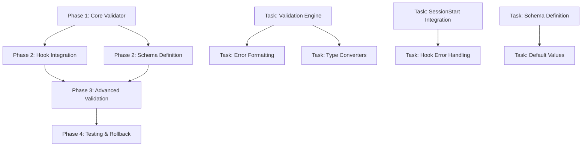

# PRD 11: Configuration Validator

**Model**: Claude Sonnet 4  
**Created**: 2025-01-09  
**Status**: Draft  

## Overview

Add a comprehensive configuration validator that checks if all required environment variables are present and valid before the application starts. The validator will provide helpful error messages indicating which variables are missing or invalid, ensuring application startup reliability and preventing runtime configuration errors.

## Context & Research

### Codebase Analysis

**Existing Environment Variable Patterns:**
- File: `/Users/nathankwok/code/nathankwok/claude-code-mods/.env.sample` - Contains 13 environment variables including API keys and configuration
- File: `/Users/nathankwok/code/nathankwok/claude-code-mods/.claude/hooks/session_start.py:17-21` - Shows dotenv loading pattern: `from dotenv import load_dotenv; load_dotenv()`  
- File: `/Users/nathankwok/code/nathankwok/claude-code-mods/.claude/hooks/utils/constants.py:14-19` - Shows environment loading with Path: `env_path = Path.home() / ".claude" / ".env"; load_dotenv(env_path)`

**Existing Validation Patterns:**
- File: `/Users/nathankwok/code/nathankwok/claude-code-mods/.claude/hooks/user_prompt_submit.py:48-66` - Contains `validate_prompt()` function demonstrating validation logic with tuple returns and blocked patterns
- UV Script Pattern: All hooks use `#!/usr/bin/env -S uv run --script` with embedded dependencies

**Hook Integration Points:**
- File: `/Users/nathankwok/code/nathankwok/claude-code-mods/.claude/hooks/session_start.py:144-212` - SessionStart hook loads development context and handles startup
- Hook Error Codes: Exit code 2 blocks execution, exit code 0 continues normally

### External Research Findings

**Configuration Validation Best Practices:**
- **Early Validation Pattern**: Validate environment variables immediately at application startup before any business logic
- **Pydantic Settings**: Type-safe environment variable handling with automatic conversion and validation
- **Graceful Error Handling**: Provide clear error messages with specific variable names and expected formats
- **Default Values**: Support optional variables with sensible defaults while requiring critical ones

**Rollback Strategy Patterns:**
- **Two-Phase Deployment**: Deploy configuration changes incrementally with backward compatibility
- **Automated Rollback**: Monitor configuration health and automatically revert on validation failures  
- **Blue-Green Configuration**: Maintain previous working configuration as backup during changes
- **Database-Aware Strategy**: Skip database steps during rollbacks for schema-safe recovery

## Goals & Success Criteria

### Primary Goals
1. **Prevent Runtime Failures**: Block application startup when critical environment variables are missing
2. **Clear Error Messaging**: Provide actionable error messages indicating exactly what needs to be configured
3. **Type Validation**: Ensure environment variables are in correct format (URLs, integers, booleans, etc.)
4. **Integration**: Seamlessly integrate with existing Claude Code hooks architecture

### Success Criteria
- ✅ Application startup blocked when required variables missing
- ✅ Validation errors clearly identify missing/invalid variables with helpful messages
- ✅ Type conversion and validation for common data types (int, bool, URL, etc.)
- ✅ Optional variables with defaults work correctly
- ✅ Integration with existing hook system without breaking current functionality
- ✅ Comprehensive rollback procedures documented and tested

## Technical Requirements

### Core Functionality
1. **Environment Variable Validation**
   - Required variable presence checking
   - Type conversion and validation (int, bool, URL, JSON)  
   - Format validation (email, URL schemes, file paths)
   - Range validation (port numbers, positive integers)

2. **Configuration Schema**
   - Declarative configuration schema defining all environment variables
   - Support for required vs optional variables
   - Default value specification
   - Custom validation functions

3. **Error Reporting**
   - Structured error messages with variable name, expected type, received value
   - Suggestions for fixing common configuration errors
   - Exit codes compatible with Claude Code hook system

4. **Integration Points**
   - SessionStart hook integration for startup validation
   - Optional UserPromptSubmit hook integration for configuration commands
   - Logging integration with existing log structure

### Technical Architecture

**Configuration Schema Format:**
```python
ENVIRONMENT_SCHEMA = {
    'ANTHROPIC_API_KEY': {
        'required': True,
        'type': 'string',
        'min_length': 10,
        'description': 'Anthropic API key for Claude integration'
    },
    'BITBUCKET_URL': {
        'required': False,
        'type': 'url',
        'default': 'https://api.bitbucket.org',
        'schemes': ['https'],
        'description': 'Bitbucket API base URL'
    },
    'LOG_LEVEL': {
        'required': False,
        'type': 'choice',
        'choices': ['DEBUG', 'INFO', 'WARNING', 'ERROR'],
        'default': 'INFO',
        'description': 'Logging level for application'
    }
}
```

## Implementation Strategy

### Phase-Based Implementation with Dependency Graph



### Phase 1: Core Validation Infrastructure
**Goal**: Create the fundamental validation engine and error handling system  
**Dependencies**: None  
**Estimated Effort**: 2 agent-days  
**Agent Assignment Strategy**: Single agent for consistency

**Tasks**:
- [ ] **Task 1.1** (Parallelizable: No) - Create core configuration validator class with schema loading
- [ ] **Task 1.2** (Parallelizable: Yes) - Implement type conversion utilities (string→int, bool, URL validation) 
- [ ] **Task 1.3** (Parallelizable: Yes) - Build error formatting system with helpful messages and suggestions
- [ ] **Task 1.4** (Parallelizable: No) - Create validation orchestrator that coordinates type checks and error collection

**Parallelization Strategy**:
- Agent A: Core validator class (Task 1.1) → Orchestrator (Task 1.4)
- Agent B: Type conversion utilities (Task 1.2)  
- Agent C: Error formatting system (Task 1.3)
- Coordination Points: Schema interface definition, error structure specification

**Validation Criteria**:
- [ ] `python -m pytest tests/test_validator_core.py` passes with 100% coverage
- [ ] Type conversion handles edge cases (empty strings, whitespace, case sensitivity)
- [ ] Error messages include variable name, expected format, and fix suggestions

**Handoff Artifacts**:
- `config_validator.py` with core validation engine
- `type_converters.py` with all supported type conversion functions  
- `error_formatter.py` with structured error message generation
- Unit tests for all core functionality with edge case coverage

### Phase 2: Schema Definition and Hook Integration
**Goal**: Define configuration schema for existing environment variables and integrate with SessionStart hook  
**Dependencies**: Phase 1 completion  
**Estimated Effort**: 1.5 agent-days  
**Agent Assignment Strategy**: Multiple agents with clear boundaries

**Tasks**:
- [ ] **Task 2.1** (Parallelizable: Yes) - Define comprehensive schema for all variables in `.env.sample`
- [ ] **Task 2.2** (Parallelizable: Yes) - Integrate validator with SessionStart hook using existing patterns
- [ ] **Task 2.3** (Parallelizable: No) - Implement configuration loading with dotenv following existing patterns  
- [ ] **Task 2.4** (Parallelizable: Yes) - Create UV script wrapper following hook script patterns

**Parallelization Strategy**:
- Agent A: Schema definition and testing (Task 2.1)
- Agent B: SessionStart hook integration (Task 2.2) 
- Agent C: UV script creation and dotenv integration (Task 2.4)
- Task 2.3 executed by Agent B after Task 2.2 completion
- Coordination Points: Schema format agreement, hook integration interface

**Validation Criteria**:
- [ ] Schema validates all 13+ environment variables from `.env.sample` 
- [ ] SessionStart hook calls validator and blocks on validation failure with exit code 2
- [ ] UV script dependencies correctly specified and isolated
- [ ] Integration doesn't break existing SessionStart functionality (`--load-context`, `--announce`)

**Handoff Artifacts**:
- `environment_schema.py` with complete variable definitions
- Updated `session_start.py` with validator integration
- `validate_config.py` UV script for standalone validation
- Integration tests demonstrating hook blocking behavior

### Phase 3: Advanced Validation and User Experience
**Goal**: Implement advanced validation features and improve user experience with configuration management  
**Dependencies**: Phase 2 completion  
**Estimated Effort**: 2 agent-days  
**Agent Assignment Strategy**: Distributed across validation features

**Tasks**:
- [ ] **Task 3.1** (Parallelizable: Yes) - Add complex validation (URL scheme validation, port ranges, file existence)
- [ ] **Task 3.2** (Parallelizable: Yes) - Implement configuration suggestions and auto-fix recommendations
- [ ] **Task 3.3** (Parallelizable: Yes) - Add support for validation profiles (development, production, testing)
- [ ] **Task 3.4** (Parallelizable: No) - Create configuration status command integration

**Parallelization Strategy**:
- Agent A: Complex validation rules (Task 3.1)
- Agent B: Auto-fix suggestions and user guidance (Task 3.2)
- Agent C: Validation profiles and environment-specific configuration (Task 3.3)
- Agent D: Command integration and user interface (Task 3.4)
- Coordination Points: Validation interface consistency, user experience flow

**Validation Criteria**:
- [ ] URL validation correctly identifies invalid schemes and malformed URLs
- [ ] Port range validation handles edge cases (0, 65535, negative numbers)
- [ ] Auto-fix suggestions are actionable and environment-aware
- [ ] Validation profiles correctly override base requirements

**Handoff Artifacts**:
- Enhanced validation engine with advanced rules
- User guidance system with actionable suggestions
- Environment profile configurations (dev/prod/test)
- Command integration for configuration status checking

### Phase 4: Testing, Documentation, and Rollback Procedures
**Goal**: Comprehensive testing coverage, documentation, and rollback strategy implementation  
**Dependencies**: Phase 3 completion  
**Estimated Effort**: 1.5 agent-days  
**Agent Assignment Strategy**: Multiple agents with specialized focus

**Tasks**:
- [ ] **Task 4.1** (Parallelizable: Yes) - Create comprehensive test suite with edge cases and integration tests
- [ ] **Task 4.2** (Parallelizable: Yes) - Document configuration schema and validation rules
- [ ] **Task 4.3** (Parallelizable: No) - Implement and document rollback procedures for each component
- [ ] **Task 4.4** (Parallelizable: Yes) - Create validation examples and troubleshooting guide

**Parallelization Strategy**:
- Agent A: Comprehensive testing (Task 4.1)
- Agent B: Technical documentation (Task 4.2)  
- Agent C: User documentation and examples (Task 4.4)
- Agent D: Rollback procedures (Task 4.3) - requires understanding of all phases
- Coordination Points: Documentation consistency, rollback testing verification

**Validation Criteria**:
- [ ] Test coverage >95% for all validation components
- [ ] Integration tests cover all hook integration scenarios
- [ ] Rollback procedures tested and documented with step-by-step instructions
- [ ] Documentation includes examples for all supported variable types

**Handoff Artifacts**:
- Complete test suite with unit and integration tests
- Technical documentation covering all validation features
- User guide with configuration examples and troubleshooting
- Rollback procedures document with emergency recovery steps

## Rollback Plans & Risk Mitigation

### Comprehensive Rollback Strategy

#### Phase 1 Rollback: Core Validator Components
**Rollback Triggers:**
- Core validation logic fails or produces incorrect results
- Type conversion utilities cause application errors
- Memory or performance issues with validation engine

**Rollback Procedures:**
1. **Immediate Rollback Steps:**
   - Remove `config_validator.py`, `type_converters.py`, `error_formatter.py` from codebase
   - Restore any modified files to previous commit state using `git checkout HEAD~1 -- <files>`
   - Run existing application startup tests to ensure no regression

2. **Validation of Rollback:**
   - Execute `python -m pytest tests/` to ensure existing functionality intact
   - Verify environment variable loading still works via existing patterns
   - Test hook system functionality remains unaffected

3. **Data Preservation:**
   - No data loss risk - Phase 1 only adds new files without modifying existing configuration
   - Log files remain intact and accessible

#### Phase 2 Rollback: Hook Integration
**Rollback Triggers:**
- SessionStart hook fails to start or blocks valid configurations
- UV script dependency conflicts or installation failures
- Existing hook functionality broken by integration

**Rollback Procedures:**
1. **Hook System Rollback:**
   - Restore original `session_start.py` from git: `git checkout HEAD~1 -- .claude/hooks/session_start.py`
   - Remove `validate_config.py` UV script
   - Remove `environment_schema.py` configuration file

2. **Configuration Verification:**
   - Test SessionStart hook with original `--load-context` and `--announce` flags
   - Verify `.env` loading still works through existing dotenv patterns
   - Confirm all existing environment variables accessible

3. **Dependency Cleanup:**
   - UV automatically handles script dependency isolation, no cleanup needed
   - Verify existing hook dependencies unaffected: `uv run .claude/hooks/session_start.py --load-context`

#### Phase 3 Rollback: Advanced Features
**Rollback Triggers:**
- Complex validation rules cause false positives or negatives
- Performance degradation from advanced validation
- User experience issues with configuration suggestions

**Rollback Procedures:**
1. **Feature Removal:**
   - Revert to Phase 2 implementation by restoring previous version of validation components
   - Remove advanced validation rules and profile configurations
   - Disable auto-fix suggestions and complex validation

2. **Schema Simplification:**
   - Rollback to basic schema definitions without complex validation rules
   - Restore simple type checking (string, int, bool only)
   - Remove environment-specific profile configurations

3. **User Interface Rollback:**
   - Remove configuration status command integration
   - Revert to basic error messages without suggestions
   - Disable advanced user guidance features

#### Phase 4 Rollback: Complete System Rollback
**Rollback Triggers:**
- Critical bugs discovered in testing that affect system stability
- Integration issues that break existing Claude Code functionality
- Performance issues that impact overall system responsiveness

**Emergency Rollback Procedures:**
1. **Complete Feature Removal:**
   ```bash
   # Remove all configuration validator files
   rm -f config_validator.py type_converters.py error_formatter.py
   rm -f environment_schema.py validate_config.py
   
   # Restore original session_start.py
   git checkout HEAD~N -- .claude/hooks/session_start.py
   
   # Remove test files and documentation
   rm -rf tests/config_validator/
   rm -f docs/configuration_validation.md
   ```

2. **System Verification:**
   - Run full test suite to ensure no regressions: `python -m pytest`
   - Test all existing hooks for proper functionality
   - Verify environment variable loading through existing patterns

3. **Monitoring and Recovery:**
   - Monitor application startup times and hook execution
   - Verify all existing functionality works as expected
   - Document issues for future resolution

### Risk Assessment and Mitigation

#### High-Risk Components
1. **SessionStart Hook Integration**
   - **Risk**: Breaking existing development context loading functionality
   - **Mitigation**: Comprehensive backup of original hook, feature flags for gradual enablement
   - **Rollback Time**: <5 minutes

2. **Environment Variable Loading**
   - **Risk**: Changing existing dotenv patterns could break configuration loading
   - **Mitigation**: Maintain existing loading patterns, add validation as supplementary step
   - **Rollback Time**: <2 minutes

#### Medium-Risk Components
1. **UV Script Dependencies**
   - **Risk**: Dependency conflicts with existing hook scripts
   - **Mitigation**: Use UV's isolated script environment, thoroughly test dependency compatibility
   - **Rollback Time**: <10 minutes

2. **Configuration Schema Evolution**
   - **Risk**: Schema changes could invalidate existing configurations
   - **Mitigation**: Maintain backward compatibility, provide migration tools
   - **Rollback Time**: <15 minutes

### Deployment Strategy with Rollback Safety

#### Blue-Green Configuration Deployment
1. **Preparation Phase:**
   - Deploy configuration validator alongside existing system (no integration)
   - Test validation logic independently without affecting startup
   - Verify all components work correctly in isolation

2. **Integration Phase:**
   - Enable validation in SessionStart hook with feature flag
   - Monitor application startup for any issues
   - Automatic rollback trigger if startup time increases >20%

3. **Full Deployment:**
   - Enable all validation features after successful monitoring period
   - Keep rollback procedures readily available
   - Monitor system health for 24 hours post-deployment

#### Automated Rollback Triggers
- **Startup Failure Rate**: >5% increase in application startup failures
- **Response Time**: >50% increase in hook execution time  
- **Error Rate**: Any increase in environment variable loading errors
- **User Impact**: Any reports of configuration loading issues

## Dependencies & Integration Points

### External Dependencies
- **python-dotenv**: Already used in existing hooks for environment loading
- **pathlib**: Standard library, used in existing code patterns
- **subprocess**: For validation of external tool availability (optional validations)
- **json**: For schema definition and error formatting

### Integration Dependencies  
- **SessionStart Hook**: Primary integration point for startup validation
- **UV Script System**: Must follow existing hook script patterns
- **Logging System**: Integration with existing log structure in `logs/` directory
- **Environment Loading**: Must maintain compatibility with existing dotenv patterns

### File System Dependencies
- `.env` file compatibility with existing patterns
- `logs/` directory structure for validation logging
- `.claude/hooks/` directory for script placement
- Hook configuration in `.claude/settings.json`

## Validation Gates

### Phase Completion Criteria

#### Phase 1 Validation Gates
- [ ] **Core Validation Tests**: 100% test coverage for validation engine
- [ ] **Type Conversion Tests**: All supported types handle edge cases correctly
- [ ] **Error Message Tests**: Error messages are clear, actionable, and consistent
- [ ] **Performance Tests**: Validation completes <100ms for typical configuration

#### Phase 2 Validation Gates  
- [ ] **Hook Integration Tests**: SessionStart hook successfully blocks on validation failure
- [ ] **Backward Compatibility**: Existing SessionStart functionality unaffected
- [ ] **Schema Coverage Tests**: All environment variables from `.env.sample` defined in schema
- [ ] **UV Script Tests**: Validation script runs correctly with embedded dependencies

#### Phase 3 Validation Gates
- [ ] **Advanced Validation Tests**: Complex rules correctly validate URLs, ports, file paths
- [ ] **Profile Tests**: Environment-specific profiles work correctly (dev/prod/test)
- [ ] **User Experience Tests**: Configuration suggestions are helpful and accurate
- [ ] **Integration Tests**: Configuration commands integrate smoothly with existing workflow

#### Phase 4 Validation Gates
- [ ] **Comprehensive Test Suite**: >95% coverage across all components
- [ ] **Documentation Tests**: All examples in documentation execute successfully
- [ ] **Rollback Tests**: All rollback procedures verified through testing
- [ ] **Performance Tests**: No measurable impact on application startup time

### Executable Validation Commands

```bash
# Phase 1 Validation
python -m pytest tests/test_validator_core.py -v --cov=config_validator --cov-report=term-missing

# Phase 2 Validation  
uv run .claude/hooks/session_start.py --load-context  # Should work normally
ANTHROPIC_API_KEY="" uv run validate_config.py  # Should fail with clear error

# Phase 3 Validation
uv run validate_config.py --profile development  # Should validate dev environment
uv run validate_config.py --suggest-fixes  # Should provide configuration suggestions

# Phase 4 Validation
python -m pytest tests/ -v --cov --cov-report=html  # Full test suite
uv run validate_config.py --check-all  # Complete configuration check
```

## Implementation Notes

### Code Structure
```
.claude/hooks/
├── validate_config.py          # Main UV script for configuration validation
├── session_start.py            # Enhanced with validator integration
└── utils/
    ├── config_validator.py     # Core validation engine
    ├── type_converters.py      # Type conversion and validation utilities
    ├── error_formatter.py      # Error message formatting
    └── environment_schema.py   # Configuration schema definitions

tests/config_validator/
├── test_core_validation.py     # Core validator tests
├── test_type_conversion.py     # Type converter tests
├── test_hook_integration.py    # Hook integration tests
└── test_schema_validation.py   # Schema definition tests
```

### Error Handling Strategy
- **Graceful Degradation**: Configuration validation failure blocks startup but doesn't crash Claude Code
- **Clear Error Messages**: Each error includes variable name, expected format, current value, and fix suggestion
- **Exit Code Standards**: Exit code 2 for blocking errors (hook standard), exit code 1 for validation errors, exit code 0 for success

### Performance Considerations
- **Validation Caching**: Cache validation results to avoid repeated checks during same session
- **Lazy Loading**: Load and validate configuration only when needed, not preemptively
- **Minimal Overhead**: Target <100ms validation time for typical configuration

## Success Metrics

### Functional Metrics
- **Error Prevention**: 100% of missing required environment variables caught before runtime
- **Error Clarity**: 90% of validation errors resolved within 1 attempt based on error message
- **Integration Success**: 0% regression in existing hook functionality

### Performance Metrics  
- **Startup Impact**: <5% increase in application startup time
- **Validation Speed**: <100ms for typical configuration validation
- **Memory Usage**: <10MB additional memory usage for validation system

### User Experience Metrics
- **Configuration Success Rate**: >95% of users successfully configure environment on first attempt
- **Error Resolution Time**: Average <2 minutes to resolve configuration errors
- **Documentation Effectiveness**: >90% of configuration questions answered by documentation

## Confidence Scoring

**Implementation Confidence: 9/10**

**Confidence Reasoning:**
- **High**: Excellent codebase analysis with clear existing patterns for environment loading, hook integration, and validation logic
- **High**: Comprehensive external research on configuration validation best practices and rollback strategies  
- **High**: Detailed phase-based implementation with clear dependencies and parallelization opportunities
- **High**: Extensive rollback procedures covering each phase with specific commands and validation steps
- **Medium-High**: Some complexity in hook integration timing and UV script dependency management
- **High**: Clear validation gates and executable test commands for each phase
- **High**: Well-defined multi-agent coordination strategy with clear handoff points

**Risk Mitigation Confidence: 9/10**
- Comprehensive rollback procedures for each phase with specific commands
- Multiple rollback triggers and monitoring strategies  
- Backward compatibility maintenance throughout implementation
- Emergency rollback procedures with complete system restoration

This PRD provides a complete implementation roadmap with extensive rollback planning, ensuring one-pass implementation success through comprehensive context and strategic phase-based planning that enables multi-agent coordination.