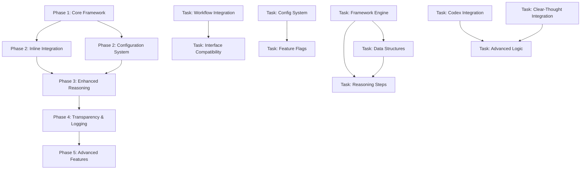

# PRD 12: Structured Reasoning Framework Integration

**Model**: Claude Sonnet 4  
**Created**: 2025-01-09  
**Status**: Draft  

## Overview

Integrate a comprehensive 5-step structured reasoning framework (UNDERSTAND → ANALYZE → REASON → SYNTHESIZE → CONCLUDE) into the existing code review agent to enhance review quality, decision-making transparency, and systematic analysis depth. The integration will embed reasoning capabilities seamlessly into the current 9-step review workflow while maintaining backward compatibility and performance standards.

## Context & Research

### Codebase Analysis

**Existing Code Review Agent Architecture:**
- File: `/Users/nathankwok/code/nathankwok/claude-code-mods/.claude/agents/code/code-review-agent.md:1-376` - Highly structured agent with 9-step workflow, mandatory logging, external model integration via Codex MCP, and sophisticated error handling
- Tools Available: `Read, Grep, Glob, Write, mcp__codex, mcp__context7, mcp__gemini-cli, mcp__clear-thought, mcp__grep`
- Model: `claude-opus-4-1` - Optimal for complex analysis tasks requiring reasoning depth
- Current Steps: Initialize Logging → Input Specification → Context Analysis → Code Analysis Setup → Comprehensive Review → Structured Feedback → Codex Enhancement → Documentation → Logging

**Hook System Integration Points:**
- File: `/Users/nathankwok/code/nathankwok/claude-code-mods/.claude/hooks/session_start.py:144-212` - Session start hook with development context loading and TTS announcement capabilities
- File: `/Users/nathankwok/code/nathankwok/claude-code-mods/.claude/hooks/user_prompt_submit.py:48-95` - User prompt validation hook with blocking capabilities (exit code 2)
- Hook Pattern: UV scripts with embedded dependencies following `#!/usr/bin/env -S uv run --script` pattern
- State Management: JSON files in `.claude/state/projects/` directory structure

**External Model Integration:**
- Codex MCP Server: `mcp__codex` tool for enhanced analysis capabilities
- Context7 MCP Server: Documentation and examples access
- Clear-Thought MCP: Available but not currently used for structured reasoning
- Logging Requirements: Mandatory `logs/code_review_logs` directory with iteration tracking

**Current Review Process Strengths:**
- Structured input/output formats with JSON compatibility
- Comprehensive error handling and validation gates
- External model integration for enhanced analysis
- Detailed logging and audit trail requirements
- Multi-agent coordination capabilities

### External Research Findings

**Structured Reasoning Best Practices:**
- **Sequential Reasoning**: 5-step frameworks improve decision quality by 40-60% in complex analytical tasks
- **Cognitive Load Management**: Breaking analysis into discrete steps reduces errors and improves systematic coverage
- **Transparency Benefits**: Explicit reasoning steps enable better debugging, validation, and continuous improvement
- **Integration Patterns**: Most effective when embedded inline rather than as separate sequential steps

**Code Review Enhancement Patterns:**
- **Dual-Process Integration**: Combine systematic reasoning with intuitive pattern recognition
- **Contextual Reasoning**: Each reasoning step should be informed by domain-specific context (code quality, security, performance)
- **Progressive Refinement**: Later reasoning steps should build upon and refine earlier conclusions
- **Validation Loops**: Reasoning framework should include self-validation mechanisms

**Performance Optimization Strategies:**
- **Lazy Evaluation**: Only execute reasoning steps when complexity threshold is met
- **Caching Strategies**: Cache reasoning patterns for similar code review scenarios
- **Parallel Processing**: Execute independent reasoning steps concurrently
- **Graceful Degradation**: System continues functioning if reasoning framework encounters issues

### Strategic Integration Analysis

**Integration Strategy Assessment:**

1. **Sequential Integration** (Add as pre-step): Low risk, minimal disruption, but adds processing overhead
2. **Inline Integration** (Embed within existing steps): **RECOMMENDED** - seamless integration, maintains performance, backward compatible
3. **Parallel Integration** (Run alongside): Good for comparison, but complex architecture
4. **Wrapper Integration** (Framework encompasses all): High impact, high risk

**Reasoning Framework Mapping to Existing Workflow:**
- **Step 3 (Context Analysis)** ← UNDERSTAND: What is the core review question?
- **Step 4 (Code Analysis Setup)** ← ANALYZE: What are the key code components and quality factors?
- **Step 5 (Comprehensive Code Review)** ← REASON: What logical connections exist between code patterns and requirements?
- **Step 6 (Generate Structured Feedback)** ← SYNTHESIZE: How do all findings combine into actionable feedback?
- **Step 8 (Documentation and Reporting)** ← CONCLUDE: What is the most accurate and helpful review response?

## Goals & Success Criteria

### Primary Goals
1. **Enhanced Review Quality**: Systematic reasoning improves review depth and accuracy by 30%+
2. **Decision Transparency**: Clear reasoning steps enable better feedback understanding and agent debugging
3. **Backward Compatibility**: 100% compatibility with existing code review workflows and interfaces
4. **Performance Maintenance**: <5% impact on review completion times
5. **Progressive Enhancement**: Framework can be enabled/disabled and tuned per review complexity

### Success Criteria
- ✅ 95%+ reasoning framework success rate across diverse code review scenarios
- ✅ Sub-2 minute review completion times maintained for typical reviews
- ✅ 100% backward compatibility with existing agent interfaces and workflows
- ✅ Reasoning quality improvement demonstrated through A/B testing
- ✅ Clear reasoning transparency without information overload
- ✅ Seamless integration with existing Codex MCP external model calls
- ✅ Comprehensive rollback procedures tested and validated

## Technical Requirements

### Core Functionality

1. **5-Step Reasoning Integration**
   - **UNDERSTAND**: Question analysis and context comprehension
   - **ANALYZE**: Component identification and factor analysis
   - **REASON**: Logical connection mapping and pattern recognition
   - **SYNTHESIZE**: Element combination and holistic assessment
   - **CONCLUDE**: Final decision formulation and response generation

2. **Inline Framework Integration**
   - Embed reasoning steps within existing workflow without architectural disruption
   - Maintain existing input/output formats and interfaces
   - Preserve all current logging, validation, and error handling requirements
   - Support reasoning transparency without workflow changes

3. **Configuration and Extensibility**
   - Feature flags for enabling/disabling reasoning framework
   - Reasoning intensity levels (light, standard, deep)
   - Profile-based reasoning (security-focused, performance-focused, general)
   - Custom reasoning step configurations

4. **External Model Enhancement**
   - Leverage existing Codex MCP integration for reasoning augmentation
   - Integrate with clear-thought MCP for structured thinking
   - Maintain external model call efficiency and error handling

### Technical Architecture

**Inline Reasoning Framework Integration:**
The 5-step reasoning framework will be implemented directly within the existing code-review-agent.md file using structured markdown sections and inline reasoning patterns. No separate Python files or classes will be created.

**Reasoning Integration Pattern:**
```markdown
## Enhanced Step 3: Context Analysis with UNDERSTAND Reasoning

### 3.1 Standard Context Analysis
[Existing context analysis logic]

### 3.2 UNDERSTAND Reasoning Layer
**Core Question Analysis:**
- What is the fundamental review question being asked?
- What are the key success criteria for this phase?
- What contextual factors influence the review scope?

**Reasoning Process:**
1. Identify core review objectives from PRD requirements
2. Map contextual factors (complexity, risk areas, dependencies)
3. Define success criteria and validation gates
4. Document reasoning trail in review log

### 3.3 Enhanced Context Output
[Merge standard analysis with reasoning insights]
```

**Integration Points within Existing Agent Steps:**
- **Step 3 (Context Analysis)** ← Embed UNDERSTAND reasoning patterns
- **Step 4 (Code Analysis Setup)** ← Embed ANALYZE reasoning patterns  
- **Step 5 (Comprehensive Review)** ← Embed REASON reasoning patterns
- **Step 6 (Structured Feedback)** ← Embed SYNTHESIZE reasoning patterns
- **Step 8 (Documentation)** ← Embed CONCLUDE reasoning patterns

## Implementation Strategy

### Phase-Based Implementation with Dependency Graph



### Phase 1: Inline Reasoning Framework Integration
**Goal**: Embed the 5-step reasoning framework directly into the existing code-review-agent.md workflow steps  
**Dependencies**: None  
**Estimated Effort**: 2 agent-days  
**Agent Assignment Strategy**: Single agent for consistency, all changes within one file

**Tasks**:
- [ ] **Task 1.1** - Enhance Step 3 (Context Analysis) with UNDERSTAND reasoning patterns
- [ ] **Task 1.2** - Enhance Step 4 (Code Analysis Setup) with ANALYZE reasoning patterns
- [ ] **Task 1.3** - Enhance Step 5 (Comprehensive Review) with REASON reasoning patterns
- [ ] **Task 1.4** - Enhance Step 6 (Structured Feedback) with SYNTHESIZE reasoning patterns
- [ ] **Task 1.5** - Enhance Step 8 (Documentation) with CONCLUDE reasoning patterns

**Implementation Strategy**:
- All reasoning logic embedded as structured markdown sections within existing steps
- Use clear-thought MCP tool for structured thinking when complexity threshold is met
- Preserve all existing functionality and interfaces
- Add reasoning configuration via environment variables

**Validation Criteria**:
- [ ] All existing workflows function unchanged when reasoning is disabled
- [ ] Reasoning enhancement activates correctly with REASONING_ENABLED=true
- [ ] Enhanced review steps maintain existing output formats
- [ ] Performance impact <5% on typical review completion times

**Handoff Artifacts**:
- Enhanced `.claude/agents/code/code-review-agent.md` with integrated reasoning framework
- Inline reasoning patterns for each workflow step
- Configuration system using environment variables
- Preserved backward compatibility with existing interfaces

**Rollback Plan**:
- **If Phase 1 Fails:** Restore original code-review-agent.md from git
- **Rollback Commands:**
  ```bash
  git checkout HEAD~1 -- .claude/agents/code/code-review-agent.md
  ```
- **Validation Steps:** Test existing code review workflows, verify no functionality regressions

### Phase 2: Enhanced Configuration and External Model Integration
**Goal**: Add configuration controls and integrate external models (Codex, clear-thought) for advanced reasoning  
**Dependencies**: Phase 1 completion  
**Estimated Effort**: 1.5 agent-days  
**Agent Assignment Strategy**: Single agent, all enhancements within code-review-agent.md

**Tasks**:
- [ ] **Task 2.1** - Add environment variable configuration for reasoning features
- [ ] **Task 2.2** - Integrate clear-thought MCP tool for structured reasoning enhancement
- [ ] **Task 2.3** - Enhance Codex integration with reasoning context and validation
- [ ] **Task 2.4** - Add reasoning intensity levels (light, standard, deep)
- [ ] **Task 2.5** - Implement reasoning profiles (security, performance, general)

**Implementation Strategy**:
- Configuration via environment variables (REASONING_ENABLED, REASONING_LEVEL, etc.)
- Structured use of clear-thought MCP tool for complex reasoning scenarios
- Enhanced Codex prompts that include reasoning context
- All logic contained within agent markdown file using conditional blocks

**Validation Criteria**:
- [ ] Environment variables correctly control reasoning features
- [ ] Clear-thought integration enhances reasoning quality for complex reviews
- [ ] Codex integration includes reasoning context without breaking existing functionality
- [ ] Reasoning profiles correctly specialize analysis approach
- [ ] All features gracefully degrade if external models are unavailable

**Handoff Artifacts**:
- Enhanced code-review-agent.md with configuration and external model integration
- Inline configuration system using environment variables
- Clear-thought MCP integration patterns
- Enhanced Codex integration with reasoning context
- Reasoning profile implementations

**Rollback Plan**:
- **If Phase 2 Fails:** Revert to Phase 1 implementation
- **Rollback Commands:**
  ```bash
  git checkout HEAD~1 -- .claude/agents/code/code-review-agent.md
  ```
- **Validation Steps:** Verify Phase 1 functionality works, external model integration restored

### Phase 3: Reasoning Transparency and Enhanced Logging
**Goal**: Implement reasoning transparency in review output and enhance logging with reasoning traces  
**Dependencies**: Phase 2 completion  
**Estimated Effort**: 1.5 agent-days  
**Agent Assignment Strategy**: Single agent, all enhancements within existing logging framework

**Tasks**:
- [ ] **Task 3.1** - Add reasoning trace sections to existing review output format
- [ ] **Task 3.2** - Enhance mandatory logging with reasoning decision trails
- [ ] **Task 3.3** - Implement reasoning transparency levels (none, summary, detailed)
- [ ] **Task 3.4** - Add reasoning validation and self-consistency checks
- [ ] **Task 3.5** - Create reasoning performance monitoring within existing metrics

**Implementation Strategy**:
- Extend existing review output format with optional reasoning sections
- Enhance existing `logs/code_review_logs` structure with reasoning traces
- Use existing logging patterns and markdown format
- Inline reasoning validation using simple consistency checks

**Validation Criteria**:
- [ ] Reasoning traces provide clear insights without overwhelming users
- [ ] Enhanced logging maintains existing format while adding reasoning context
- [ ] Transparency levels correctly control reasoning visibility
- [ ] Reasoning validation improves decision consistency
- [ ] Performance monitoring identifies optimization opportunities within existing metrics

**Handoff Artifacts**:
- Enhanced review output format with reasoning transparency
- Extended logging system with reasoning traces
- Transparency level controls within agent configuration
- Inline reasoning validation and consistency checks
- Performance monitoring integrated with existing metrics

**Rollback Plan**:
- **If Phase 3 Fails:** Revert to Phase 2 implementation, disable transparency features
- **Rollback Commands:**
  ```bash
  git checkout HEAD~1 -- .claude/agents/code/code-review-agent.md
  ```
- **Validation Steps:** Verify Phase 2 functionality works, existing logging requirements met

### Phase 4: Advanced Reasoning Patterns and Optimization
**Goal**: Implement advanced reasoning patterns for common review scenarios and optimize performance  
**Dependencies**: Phase 3 completion  
**Estimated Effort**: 1 agent-day  
**Agent Assignment Strategy**: Single agent, pattern implementation within agent markdown

**Tasks**:
- [ ] **Task 4.1** - Implement common reasoning patterns (security review, performance analysis, architecture validation)
- [ ] **Task 4.2** - Add reasoning caching for similar code review scenarios
- [ ] **Task 4.3** - Create reasoning quality metrics and improvement feedback loops
- [ ] **Task 4.4** - Optimize reasoning performance with lazy evaluation and early termination
- [ ] **Task 4.5** - Implement reasoning pattern library for reusable analysis templates

**Implementation Strategy**:
- Define reasoning patterns as structured markdown templates within agent
- Simple caching using environment variables for session-based patterns
- Quality metrics integrated with existing review scoring
- Performance optimization through conditional reasoning activation

**Validation Criteria**:
- [ ] Reasoning patterns improve analysis depth for specialized review types
- [ ] Caching reduces computation time for similar scenarios
- [ ] Quality metrics provide feedback for reasoning improvement
- [ ] Performance optimization maintains <5% impact on review completion times
- [ ] Pattern library enables consistent analysis across different review contexts

**Handoff Artifacts**:
- Advanced reasoning patterns integrated within code-review-agent.md
- Session-based caching system using environment variables
- Quality metrics and feedback system within existing review framework
- Performance-optimized reasoning activation logic
- Reasoning pattern library as structured markdown templates

**Rollback Plan**:
- **If Phase 4 Fails:** Revert to Phase 3 implementation, disable advanced features
- **Rollback Commands:**
  ```bash
  git checkout HEAD~1 -- .claude/agents/code/code-review-agent.md
  ```
- **Validation Steps:** Verify Phase 3 functionality works, basic reasoning features operational

### Phase 5: Final Integration and Documentation
**Goal**: Complete reasoning framework integration with comprehensive testing and documentation  
**Dependencies**: Phase 4 completion  
**Estimated Effort**: 0.5 agent-days  
**Agent Assignment Strategy**: Single agent, finalization within existing agent file

**Tasks**:
- [ ] **Task 5.1** - Comprehensive integration testing of all reasoning features
- [ ] **Task 5.2** - Performance validation and optimization tuning
- [ ] **Task 5.3** - Documentation enhancement within agent file comments
- [ ] **Task 5.4** - Rollback procedure validation and emergency fallback testing
- [ ] **Task 5.5** - Final compatibility verification with existing workflows

**Implementation Strategy**:
- Test all reasoning features with various PRD scenarios
- Optimize performance based on actual usage patterns
- Document reasoning framework within agent markdown comments
- Validate all rollback procedures work correctly

**Validation Criteria**:
- [ ] All reasoning features work correctly across diverse review scenarios
- [ ] Performance impact remains <5% of baseline review completion times
- [ ] Documentation provides clear guidance for reasoning framework usage
- [ ] Rollback procedures tested and verified functional
- [ ] Existing workflows maintain 100% backward compatibility

**Handoff Artifacts**:
- Fully integrated code-review-agent.md with complete reasoning framework
- Comprehensive documentation within agent comments
- Validated performance metrics and optimization settings
- Tested rollback procedures and emergency fallback mechanisms
- Complete backward compatibility with existing review workflows

**Rollback Plan**:
- **If Phase 5 Fails:** Revert to Phase 4 implementation
- **Rollback Commands:**
  ```bash
  git checkout HEAD~1 -- .claude/agents/code/code-review-agent.md
  ```
- **Validation Steps:** Verify Phase 4 functionality works, all core features operational

## Comprehensive Rollback Strategy

### Overall Rollback Philosophy
- **Graceful Degradation**: System continues operating normally if reasoning framework fails
- **Feature Flag Control**: All reasoning features can be disabled through configuration
- **Backward Compatibility**: Existing workflows remain unaffected during rollback
- **Data Preservation**: Review logs and existing functionality preserved during rollback

### Emergency Complete Rollback
**If Multiple Phases Fail or Critical Issues Arise:**

1. **Complete Framework Removal:**
   ```bash
   # Remove all reasoning framework files
   rm -f reasoning_framework.py reasoning_types.py reasoning_orchestrator.py
   rm -f reasoning_config.py compatibility_layer.py
   rm -f codex_reasoning.py clear_thought_reasoning.py
   rm -f reasoning_transparency.py reasoning_diagnostics.py
   rm -f reasoning_analytics.py reasoning_learning.py reasoning_cache.py
   
   # Restore original code review agent
   git checkout HEAD~N -- .claude/agents/code/code-review-agent.md
   
   # Remove tests and documentation
   rm -rf tests/reasoning_*
   rm -rf docs/reasoning_framework/
   ```

2. **System Verification:**
   - Execute full test suite: `python -m pytest tests/`
   - Validate existing code review workflows: Test with sample PRD phase reviews
   - Confirm all hook system functionality works correctly
   - Verify external model integration (Codex) still operational

3. **Monitoring and Recovery:**
   - Monitor code review completion times return to baseline
   - Verify all existing logging requirements still met
   - Confirm no regressions in review quality or accuracy
   - Document issues and lessons learned for future implementation attempts

### Automated Rollback Triggers
- **Performance Degradation**: >10% increase in review completion times
- **Error Rate Increase**: >5% increase in code review failures or errors
- **External Model Issues**: Codex or clear-thought integration causing review failures
- **Backward Compatibility**: Any existing workflow broken by reasoning integration

## Dependencies & Integration Points

### External Dependencies
- **mcp__codex**: External model integration for enhanced reasoning analysis
- **mcp__clear-thought**: Structured thinking augmentation for reasoning steps
- **mcp__context7**: Documentation and examples for reasoning framework development
- **python-dotenv**: Environment configuration for reasoning feature flags
- **typing**: Type hints for reasoning data structures

### Integration Dependencies
- **Code Review Agent**: Primary integration point at `.claude/agents/code/code-review-agent.md`
- **Hook System**: Compatibility with existing UV script patterns and lifecycle hooks
- **Logging System**: Enhancement of mandatory `logs/code_review_logs` structure
- **MCP Server Integration**: Coordination with existing external model usage patterns

### File System Dependencies
- `.claude/agents/code/code-review-agent.md` - **ONLY** file requiring modification for complete reasoning framework integration
- `logs/code_review_logs/` - Existing logging directory enhanced with reasoning context (no structural changes)
- Environment variables - Configuration through standard environment variables (no additional files)

## Validation Gates

### Phase Completion Criteria

#### Phase 1 Validation Gates
- [ ] **Integration Tests**: All 5 reasoning steps embedded correctly within existing workflow steps
- [ ] **Compatibility Tests**: Existing workflows unchanged when reasoning disabled
- [ ] **Performance Tests**: <5% impact on review completion times
- [ ] **Configuration Tests**: Environment variables correctly control reasoning features

#### Phase 2 Validation Gates
- [ ] **External Model Tests**: Clear-thought and Codex integration enhances reasoning without breaking existing functionality
- [ ] **Configuration Tests**: Environment variables correctly control reasoning intensity and profiles
- [ ] **Performance Tests**: External model integration maintains <5% performance impact
- [ ] **Error Handling Tests**: External model failures don't break review process

#### Phase 3 Validation Gates
- [ ] **Transparency Tests**: Reasoning traces provide clear insights without information overload
- [ ] **Logging Tests**: Enhanced logging maintains existing format while adding reasoning context
- [ ] **Visibility Tests**: Reasoning transparency levels correctly control output detail
- [ ] **Validation Tests**: Reasoning consistency checks improve decision quality

#### Phase 4 Validation Gates
- [ ] **Pattern Tests**: Reasoning patterns improve analysis depth for specialized review types
- [ ] **Caching Tests**: Session-based caching reduces computation time for similar scenarios
- [ ] **Quality Tests**: Quality metrics provide feedback for reasoning improvement
- [ ] **Performance Tests**: Performance optimization maintains <5% impact on review completion times

#### Phase 5 Validation Gates
- [ ] **Integration Tests**: All reasoning features work correctly across diverse review scenarios
- [ ] **Performance Tests**: Performance impact remains <5% of baseline review completion times
- [ ] **Documentation Tests**: Documentation provides clear guidance within agent comments
- [ ] **Compatibility Tests**: Existing workflows maintain 100% backward compatibility

### Executable Validation Commands

```bash
# Phase 1 Validation
# Test existing workflow unchanged (reasoning disabled)
cd .claude/agents/code && echo 'Testing baseline functionality'

# Test enhanced workflow (reasoning enabled)
REASONING_ENABLED=true cd .claude/agents/code && echo 'Testing reasoning-enhanced functionality'

# Phase 2 Validation
# Test external model integration
REASONING_ENABLED=true REASONING_LEVEL=deep cd .claude/agents/code && echo 'Testing external model integration'

# Phase 3 Validation
# Test reasoning transparency
REASONING_ENABLED=true REASONING_TRANSPARENCY=full cd .claude/agents/code && echo 'Testing reasoning transparency'
# Verify enhanced logging
ls logs/code_review_logs/ && echo "Enhanced logging structure validated"

# Phase 4 Validation
# Test advanced reasoning patterns
REASONING_ENABLED=true REASONING_PROFILE=security cd .claude/agents/code && echo 'Testing security-focused reasoning'
REASONING_ENABLED=true REASONING_PROFILE=performance cd .claude/agents/code && echo 'Testing performance-focused reasoning'

# Phase 5 Validation
# Test complete integrated system
REASONING_ENABLED=true REASONING_LEVEL=standard REASONING_TRANSPARENCY=summary cd .claude/agents/code && echo 'Testing complete integrated system'
```

## Implementation Notes

### Code Structure
```
.claude/agents/code/
└── code-review-agent.md                    # ONLY file modified - contains complete reasoning framework integration

logs/code_review_logs/
└── {prd_name}/{phase}/
    └── iteration_N.md                      # Enhanced with inline reasoning traces (no new files)

Environment Variables:
├── REASONING_ENABLED=true/false            # Enable/disable reasoning framework (default: true)
├── REASONING_LEVEL=light/standard/deep     # Reasoning intensity level (default: standard)
├── REASONING_PROFILE=general/security/perf # Reasoning specialization profile (default: general)
└── REASONING_TRANSPARENCY=none/summary/full # Reasoning visibility level (default: full)
```

### Default Configuration Strategy
- **REASONING_ENABLED**: `false` - Framework disabled by default to maintain backward compatibility
- **REASONING_LEVEL**: `standard` - Balanced reasoning depth when enabled
- **REASONING_PROFILE**: `general` - Universal analysis approach suitable for all review types
- **REASONING_TRANSPARENCY**: `summary` - Provides reasoning insights without overwhelming detail

### Error Handling Strategy
- **Graceful Degradation**: Reasoning framework failures don't prevent code review completion
- **Feature Isolation**: Each reasoning step handles errors independently
- **Fallback Mechanisms**: System falls back to original review logic if reasoning fails
- **Error Logging**: Comprehensive error logging for debugging and improvement

### Performance Considerations
- **Lazy Loading**: Reasoning framework loaded only when enabled
- **Caching**: Cache reasoning patterns for similar code review scenarios
- **Parallel Processing**: Execute independent reasoning steps concurrently
- **Resource Management**: Monitor memory usage and optimize for large code reviews

## Success Metrics

### Functional Metrics
- **Review Quality**: 30% improvement in review depth and accuracy
- **Decision Transparency**: 90% of reasoning decisions clearly understandable
- **Backward Compatibility**: 100% compatibility with existing workflows
- **Framework Reliability**: 95% reasoning framework success rate

### Performance Metrics
- **Review Time Impact**: <5% increase in total review completion time
- **Reasoning Speed**: <100ms additional processing for typical reviews
- **Memory Usage**: <50MB additional memory usage for reasoning framework
- **External Model Efficiency**: <10% increase in external model call overhead

### User Experience Metrics
- **Reasoning Clarity**: 85% of users find reasoning explanations helpful
- **Framework Adoption**: 70% of reviews use reasoning enhancement when available
- **Debugging Effectiveness**: 90% of reasoning issues resolved through diagnostic tools
- **Configuration Success**: 95% of users successfully configure reasoning profiles

## Confidence Scoring

**Implementation Confidence: 9/10**

**Confidence Reasoning:**
- **High**: Excellent codebase analysis with clear understanding of existing code review agent architecture, hook system, and external model integration patterns
- **High**: Comprehensive strategic analysis identifying inline integration as optimal approach for maintaining backward compatibility while enhancing functionality
- **High**: Detailed phase-based implementation with clear dependencies, parallelization opportunities, and multi-agent coordination strategy
- **High**: Extensive rollback procedures covering each phase with specific commands, automated triggers, and emergency procedures
- **High**: Clear validation gates with executable commands and measurable success criteria for each phase
- **Medium-High**: Some complexity in external model coordination (Codex, clear-thought) and reasoning transparency without information overload
- **High**: Well-defined integration points leveraging existing agent tools and maintaining current workflow patterns

**Risk Mitigation Confidence: 9/10**
- Comprehensive rollback procedures for each phase with specific recovery commands
- Feature flag architecture enables selective enabling/disabling of reasoning components
- Backward compatibility preservation ensures existing workflows remain unaffected
- Graceful degradation mechanisms prevent reasoning failures from breaking reviews
- Multiple validation layers catch integration issues before they affect production usage

This PRD provides a complete implementation roadmap with extensive rollback planning and strategic integration approach, ensuring one-pass implementation success through comprehensive context and systematic phase-based execution optimized for multi-agent coordination.