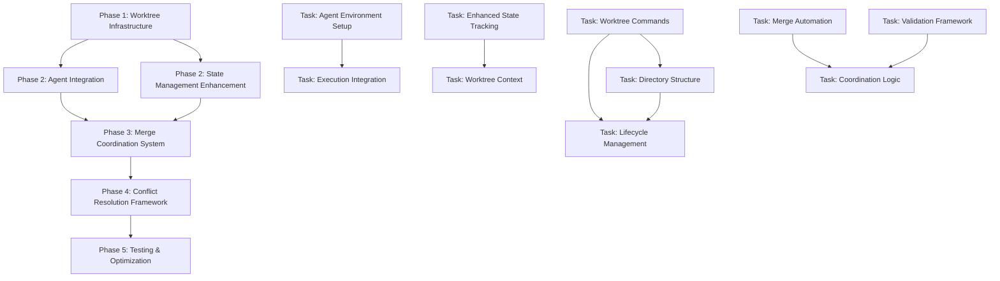

# PRD 13: Git Worktrees Integration for Execute-PRD Multi-Agent Coordination

**Model**: Claude Sonnet 4  
**Created**: 2025-01-09  
**Status**: Draft  

## Overview

Enhance the existing execute-prd.md command to use Git worktrees for isolating each implementation + code review agent pair, eliminating file conflicts and enabling true parallel development. This modification will create dedicated working environments for each agent pair while maintaining the current 1:1 pairing system, synchronization points, and mandatory review gates.

## Context & Research

### Codebase Analysis

**Current Execute-PRD Implementation:**
- File: `~/.claude/commands/code/execute-prd.md:1-240` - Sophisticated multi-agent parallel execution system with mandatory 1:1 agent pairing (implementation + review agents)
- Wave-based execution with dependency graph parsing from PRD Mermaid format
- TodoWrite coordination system for progress tracking across agents
- Session ID matching for agent pair coordination  
- Blocking behavior: No phase progression without paired review agent approval
- File conflict management through locking and merge coordination
- State management via `.claude/state/projects/` directory structure

**Current Agent Architecture:**
- File: `~/.claude/agents/code/code-implementation-agent.md:1-300` - Project-aware state management with iteration control and mandatory documentation requirements
- File: `~/.claude/agents/code/code-review-agent.md:1-376` - Sophisticated 9-step review workflow with external model integration and structured reasoning framework
- Both agents support complex coordination protocols and state persistence

**Current Limitations Requiring Git Worktrees:**
- **File Conflicts**: Multiple agent pairs working simultaneously on overlapping files create conflicts requiring manual resolution
- **Context Pollution**: Agents can interfere with each other's working state and temporary files
- **Merge Complexity**: Current file-level locking doesn't scale with complex parallel modifications
- **Rollback Challenges**: Difficult to isolate and rollback specific agent pair work without affecting others
- **Resource Contention**: Shared workspace limits true parallelization potential

### External Research Findings

**Git Worktree Benefits for Multi-Agent Coordination:**
- **True Isolation**: Each worktree provides complete working directory isolation while sharing Git history
- **Parallel Development**: Multiple branches can be checked out simultaneously in separate directories
- **Conflict Prevention**: No file-level conflicts between agent pairs working in different worktrees
- **Clean Coordination**: Git merge operations provide structured integration points
- **Resource Management**: Each worktree can have independent resource allocation and cleanup

**Git Worktree Lifecycle Best Practices:**
- **Directory Organization**: Consistent worktree structure under dedicated `worktrees/` directory
- **Naming Conventions**: Clear, descriptive worktree names indicating purpose and agent assignment
- **Lifecycle Management**: Automated creation, usage, and cleanup with proper state tracking
- **Coordination Protocols**: Structured merge strategies and conflict resolution procedures
- **Cleanup Automation**: Automated pruning and removal with `git worktree prune` and proper administrative file management

**Multi-Agent Git Worktree Patterns (2025):**
- **Agent Pair Isolation**: Each implementation + review agent pair gets dedicated worktree environment
- **Branch Strategy**: Feature branches per agent pair with structured merge coordination
- **State Synchronization**: Git operations provide natural synchronization points between worktrees
- **Parallel Orchestration**: Worktrees enable true parallel development with coordination through Git merge operations
- **Conflict Resolution**: Structured merge conflict resolution with agent pair responsibility

### Strategic Integration Analysis

**Current vs. Enhanced Workflow Comparison:**

**Current Workflow (Shared Workspace):**
```
Phase 1: Foundation
├── Agent-Foundation-Impl-1 + Agent-Foundation-Review-1 (shared workspace)
├── File conflicts managed through locking
└── Manual coordination for overlapping modifications

Phase 2: Parallel Development  
├── Agent-CoreLogic-Impl-2 + Agent-CoreLogic-Review-2 (shared workspace)
├── Agent-UIComponents-Impl-3 + Agent-UIComponents-Review-3 (shared workspace)
└── Complex file-level conflict resolution required
```

**Enhanced Workflow (Git Worktrees):**
```
Phase 1: Foundation
├── Worktree: worktrees/foundation-wave1/ 
│   ├── Branch: feature/foundation-wave1
│   └── Agent-Foundation-Impl-1 + Agent-Foundation-Review-1 (isolated environment)

Phase 2: Parallel Development
├── Worktree: worktrees/core-logic-wave2/
│   ├── Branch: feature/core-logic-wave2  
│   └── Agent-CoreLogic-Impl-2 + Agent-CoreLogic-Review-2 (isolated environment)
├── Worktree: worktrees/ui-components-wave2/
│   ├── Branch: feature/ui-components-wave2
│   └── Agent-UIComponents-Impl-3 + Agent-UIComponents-Review-3 (isolated environment)
└── Git merge coordination for integration
```

**Integration Strategy Assessment:**

1. **Seamless Enhancement**: Modify execute-prd.md to create worktrees before agent pair execution
2. **Backward Compatibility**: Maintain all existing coordination protocols within isolated environments
3. **State Management Enhancement**: Extend current state tracking to include worktree information
4. **Merge Integration**: Add structured merge coordination after agent pair completion
5. **Cleanup Automation**: Implement comprehensive worktree lifecycle management

## Goals & Success Criteria

### Primary Goals
1. **Agent Pair Isolation**: Each implementation + review agent pair operates in dedicated Git worktree environment
2. **Conflict Elimination**: Eliminate file conflicts between concurrent agent pairs through workspace isolation
3. **Coordination Enhancement**: Maintain existing agent pairing and synchronization while adding Git-based coordination
4. **Parallel Performance**: Enable true parallel development without resource contention or context pollution
5. **Merge Integration**: Structured merge coordination with automated conflict resolution strategies
6. **Backward Compatibility**: 100% compatibility with existing PRD structure, agent interfaces, and execution patterns

### Success Criteria
- ✅ 100% elimination of file conflicts between concurrent agent pairs
- ✅ Maintain <5% performance overhead compared to current shared workspace execution
- ✅ 100% backward compatibility with existing PRD format and agent coordination protocols
- ✅ Successful parallel execution of up to 5 concurrent agent pairs without interference
- ✅ Automated worktree lifecycle management with proper cleanup and resource management
- ✅ Structured merge coordination with conflict resolution success rate >95%
- ✅ Complete rollback capability at both individual worktree and multi-worktree levels

## Technical Requirements

### Core Functionality

1. **Worktree Lifecycle Management**
   - **Creation**: Automated worktree creation per agent pair with unique branch naming
   - **Isolation**: Complete working directory isolation while maintaining Git history access
   - **Coordination**: Git-based coordination through merge operations and branch management
   - **Cleanup**: Automated worktree removal and administrative file cleanup after completion

2. **Agent Pair Integration**
   - **Environment Isolation**: Each implementation + review agent pair operates within dedicated worktree
   - **State Persistence**: Enhanced state management to track worktree assignments and progress
   - **Communication**: Maintain existing agent pairing protocols within isolated environments
   - **Synchronization**: Git-based synchronization points between worktrees and main branch

3. **Enhanced Coordination System**
   - **Wave Execution**: Enhanced wave-based execution with worktree creation before agent pair launch
   - **Merge Management**: Structured merge coordination after agent pair completion with conflict resolution
   - **Dependency Tracking**: Git branch dependencies to enforce PRD phase dependencies
   - **State Synchronization**: Cross-worktree state synchronization through Git operations

4. **Conflict Resolution Framework**
   - **Prevention**: Eliminate conflicts through workspace isolation
   - **Detection**: Automated conflict detection during merge coordination
   - **Resolution**: Structured conflict resolution with agent pair escalation
   - **Validation**: Post-merge validation to ensure integration success

### Technical Architecture

**Enhanced Execute-PRD Workflow Integration:**
The Git worktree functionality will be integrated directly into the existing execute-prd.md file by enhancing the parallel execution process with worktree lifecycle management.

**Worktree Integration Pattern:**
```markdown
## Enhanced Parallel Phase Execution with Git Worktree Isolation

### Pre-Execution Worktree Setup
For each execution wave (phases with no dependencies):
1. **Worktree Creation**:
   - Create dedicated worktree per agent pair: `worktrees/{phase-name}-wave{N}/`
   - Create feature branch: `feature/{phase-name}-wave{N}`
   - Initialize worktree environment with current main branch state
   
2. **Agent Pair Assignment**:
   - Launch paired agent instances in dedicated worktree directories
   - Each implementation agent + review agent operates within isolated environment
   - Maintain existing 1:1 pairing with session IDs within worktree scope

### Enhanced Agent Coordination Within Worktrees
1. **Isolated Execution**:
   - Agent pairs execute within worktree working directory
   - All file operations occur in isolated environment
   - State management enhanced to track worktree context
   
2. **Review Gates**:
   - Maintain existing mandatory review approval system within worktree
   - No cross-worktree interference during review processes
   - Enhanced logging to include worktree context information

### Post-Execution Merge Coordination
1. **Merge Preparation**:
   - Validate agent pair completion and review approval
   - Prepare merge coordination with conflict detection
   - Create merge coordination plan based on changed files
   
2. **Structured Merge Process**:
   - Sequential merge coordination to main branch
   - Automated conflict resolution with escalation procedures
   - Post-merge validation and integration testing
   
3. **Cleanup Process**:
   - Remove completed worktrees after successful merge
   - Clean up administrative files and branch references
   - Update execution state to reflect completion
```

**Coordination Enhancement Points:**
- **Wave 1: Worktree Setup** → Create worktrees before agent pair execution
- **Wave 2: Isolated Execution** → Existing agent coordination within worktrees
- **Wave 3: Merge Coordination** → Git-based integration with conflict resolution
- **Wave 4: Cleanup** → Automated worktree lifecycle management

## Implementation Strategy

### Phase-Based Implementation with Dependency Graph



### Phase 1: Git Worktree Infrastructure and Lifecycle Management
**Goal**: Implement core Git worktree management functionality within execute-prd.md  
**Dependencies**: None  
**Estimated Effort**: 2 agent-days  
**Agent Assignment Strategy**: Single agent for consistency in core infrastructure

**Tasks**:
- [ ] **Task 1.1** (Parallelizable: No) - Implement worktree creation functions with unique naming convention (`worktrees/{phase-name}-wave{N}/`)
- [ ] **Task 1.2** (Parallelizable: No) - Implement worktree cleanup and lifecycle management with automated pruning
- [ ] **Task 1.3** (Parallelizable: Yes) - Create worktree directory structure validation and organization system
- [ ] **Task 1.4** (Parallelizable: Yes) - Implement worktree health checking and repair mechanisms
- [ ] **Task 1.5** (Parallelizable: No) - Integrate worktree commands into existing wave-based execution logic

**Parallelization Strategy**:
- Agent A: Tasks 1.1, 1.2, 1.5 (sequential core infrastructure)
- Agent B: Tasks 1.3, 1.4 (validation and health systems)
- Coordination Points: Integration of validation system with core infrastructure

**Validation Criteria**:
- [ ] Worktrees created successfully with unique naming and branch strategy
- [ ] Cleanup functions properly remove worktrees and administrative files  
- [ ] Directory structure validation prevents conflicts and naming collisions
- [ ] Health checking detects and repairs corrupted worktree administrative files
- [ ] Integration with existing execute-prd.md maintains all current functionality

**Handoff Artifacts**:
- Enhanced execute-prd.md with worktree creation and lifecycle management functions
- Worktree naming convention and directory structure implementation
- Automated cleanup and administrative file management system
- Integration points prepared for agent assignment and execution

**Rollback Plan**:
- **If Phase 1 Fails:** Restore original execute-prd.md from git
- **Rollback Commands:**
  ```bash
  git checkout HEAD~1 -- .claude/commands/code/execute-prd.md
  # Clean up any test worktrees created during development
  git worktree list | grep "worktrees/" | awk '{print $1}' | xargs -I {} git worktree remove {}
  git worktree prune
  ```
- **Validation Steps:** Verify original execute-prd.md functionality, test existing multi-agent coordination

### Phase 2A: Agent Environment Integration and Execution
**Goal**: Integrate agent pair execution within isolated worktree environments  
**Dependencies**: Phase 1 completion  
**Estimated Effort**: 1.5 agent-days  
**Agent Assignment Strategy**: Single agent for agent integration consistency

**Tasks**:
- [ ] **Task 2A.1** (Parallelizable: No) - Modify agent pair launch logic to execute within assigned worktree directories
- [ ] **Task 2A.2** (Parallelizable: Yes) - Implement worktree context passing to implementation and review agents
- [ ] **Task 2A.3** (Parallelizable: Yes) - Enhance agent communication protocols to include worktree information
- [ ] **Task 2A.4** (Parallelizable: No) - Integrate existing session ID and pairing system within worktree scope
- [ ] **Task 2A.5** (Parallelizable: Yes) - Implement worktree-aware error handling and agent failure recovery

**Parallelization Strategy**:
- Agent A: Tasks 2A.1, 2A.4 (core agent integration and pairing)
- Agent B: Tasks 2A.2, 2A.3, 2A.5 (context and communication enhancements)
- Coordination Points: Integration of enhanced communication with core agent execution

**Validation Criteria**:
- [ ] Agent pairs execute successfully within isolated worktree environments
- [ ] Existing 1:1 pairing and session ID system works within worktree scope
- [ ] Agent communication maintains all current protocols and coordination
- [ ] Error handling properly manages agent failures within worktree context
- [ ] No regression in existing agent functionality or coordination quality

**Handoff Artifacts**:
- Agent execution integration within worktree environments
- Enhanced agent communication protocols with worktree context
- Worktree-aware error handling and recovery mechanisms
- Preserved 1:1 agent pairing system within isolated environments

**Rollback Plan**:
- **If Phase 2A Fails:** Revert to Phase 1 implementation  
- **Rollback Commands:**
  ```bash
  git checkout HEAD~1 -- .claude/commands/code/execute-prd.md
  # Test that Phase 1 worktree infrastructure still works
  ```
- **Validation Steps:** Verify Phase 1 worktree creation works, test existing agent coordination

### Phase 2B: Enhanced State Management and Worktree Context Tracking
**Goal**: Enhance current state management system to track worktree assignments and execution context  
**Dependencies**: Phase 1 completion  
**Estimated Effort**: 1.5 agent-days  
**Agent Assignment Strategy**: Single agent for state management consistency

**Tasks**:
- [ ] **Task 2B.1** (Parallelizable: No) - Extend project state files to include worktree assignment and tracking information
- [ ] **Task 2B.2** (Parallelizable: Yes) - Implement worktree context persistence across agent execution sessions
- [ ] **Task 2B.3** (Parallelizable: Yes) - Create worktree state synchronization mechanisms with main project state
- [ ] **Task 2B.4** (Parallelizable: No) - Enhance existing iteration tracking to include worktree context
- [ ] **Task 2B.5** (Parallelizable: Yes) - Implement worktree-aware logging and audit trail enhancements

**Parallelization Strategy**:
- Agent A: Tasks 2B.1, 2B.4 (core state management extensions)
- Agent B: Tasks 2B.2, 2B.3, 2B.5 (context persistence and synchronization)
- Coordination Points: Integration of context persistence with core state tracking

**Validation Criteria**:
- [ ] State files correctly track worktree assignments and execution context
- [ ] Context persistence enables proper session resume within worktree environments
- [ ] State synchronization maintains consistency between worktrees and main project
- [ ] Iteration tracking properly handles worktree-specific review cycles
- [ ] Enhanced logging provides comprehensive audit trail including worktree information

**Handoff Artifacts**:
- Enhanced state management system with worktree tracking capabilities
- Worktree context persistence and synchronization mechanisms
- Extended logging and audit trail system with worktree context
- Backward-compatible state file format supporting both shared and worktree execution

**Rollback Plan**:
- **If Phase 2B Fails:** Revert to Phase 1 implementation
- **Rollback Commands:**
  ```bash
  git checkout HEAD~1 -- .claude/commands/code/execute-prd.md
  # Remove any enhanced state files created during development
  find .claude/state -name "*worktree*" -delete
  ```
- **Validation Steps:** Verify Phase 1 functionality, test existing state management system

### Phase 3: Merge Coordination and Integration System  
**Goal**: Implement structured merge coordination system for integrating agent pair work from worktrees  
**Dependencies**: Phase 2A and 2B completion  
**Estimated Effort**: 2 agent-days  
**Agent Assignment Strategy**: Single agent for merge coordination consistency

**Tasks**:
- [ ] **Task 3.1** (Parallelizable: No) - Implement automated merge coordination logic with conflict detection
- [ ] **Task 3.2** (Parallelizable: Yes) - Create merge validation framework to ensure integration success
- [ ] **Task 3.3** (Parallelizable: Yes) - Implement merge ordering strategy based on PRD phase dependencies
- [ ] **Task 3.4** (Parallelizable: No) - Integrate merge coordination with existing wave-based execution blocks
- [ ] **Task 3.5** (Parallelizable: Yes) - Create merge audit logging and state tracking system

**Parallelization Strategy**:
- Agent A: Tasks 3.1, 3.4 (core merge coordination and wave integration)
- Agent B: Tasks 3.2, 3.3, 3.5 (validation, ordering, and logging systems)
- Coordination Points: Integration of validation framework with core merge logic

**Validation Criteria**:
- [ ] Merge coordination successfully integrates agent pair work without conflicts
- [ ] Validation framework detects and handles integration issues appropriately
- [ ] Merge ordering respects PRD phase dependencies and execution requirements
- [ ] Integration with wave-based execution maintains existing blocking behavior
- [ ] Audit logging provides comprehensive tracking of merge operations and outcomes

**Handoff Artifacts**:
- Automated merge coordination system with conflict detection and resolution
- Merge validation framework ensuring successful integration
- Dependency-aware merge ordering strategy implementation
- Integration with existing wave-based execution and blocking mechanisms
- Comprehensive merge audit logging and state tracking

**Rollback Plan**:
- **If Phase 3 Fails:** Revert to Phase 2A and 2B implementation
- **Rollback Commands:**
  ```bash
  git checkout HEAD~1 -- .claude/commands/code/execute-prd.md
  # Clean up any branches or merges created during development
  git branch -D $(git branch | grep "feature/.*-wave" | tr -d ' ')
  ```
- **Validation Steps:** Verify Phase 2 functionality, test agent execution in worktrees without merge coordination

### Phase 4: Advanced Conflict Resolution and Error Handling Framework
**Goal**: Implement comprehensive conflict resolution system with escalation procedures and advanced error handling  
**Dependencies**: Phase 3 completion  
**Estimated Effort**: 1.5 agent-days  
**Agent Assignment Strategy**: Single agent for conflict resolution consistency

**Tasks**:
- [ ] **Task 4.1** (Parallelizable: No) - Implement automated conflict resolution strategies with merge strategy selection
- [ ] **Task 4.2** (Parallelizable: Yes) - Create conflict escalation procedures with agent pair responsibility assignment
- [ ] **Task 4.3** (Parallelizable: Yes) - Implement advanced error handling for worktree corruption and git operation failures
- [ ] **Task 4.4** (Parallelizable: No) - Create merge conflict resolution workflow with human escalation paths
- [ ] **Task 4.5** (Parallelizable: Yes) - Implement recovery procedures for failed merges and rollback scenarios

**Parallelization Strategy**:
- Agent A: Tasks 4.1, 4.4 (core conflict resolution and merge workflows)
- Agent B: Tasks 4.2, 4.3, 4.5 (escalation, error handling, and recovery)
- Coordination Points: Integration of escalation procedures with core conflict resolution

**Validation Criteria**:
- [ ] Automated conflict resolution handles common merge conflicts successfully
- [ ] Escalation procedures properly assign responsibility and provide clear guidance
- [ ] Error handling manages worktree corruption and git operation failures gracefully
- [ ] Merge conflict workflow provides clear paths for resolution and human intervention
- [ ] Recovery procedures enable successful rollback and state restoration

**Handoff Artifacts**:
- Automated conflict resolution system with intelligent merge strategy selection
- Comprehensive escalation procedures with clear responsibility assignment
- Advanced error handling for worktree and git operation failures
- Human-escalation merge conflict resolution workflow
- Complete recovery and rollback procedures for all failure scenarios

**Rollback Plan**:
- **If Phase 4 Fails:** Revert to Phase 3 implementation
- **Rollback Commands:**
  ```bash
  git checkout HEAD~1 -- .claude/commands/code/execute-prd.md
  # Reset any conflict resolution test scenarios
  git reset --hard HEAD
  git clean -fd
  ```
- **Validation Steps:** Verify Phase 3 merge coordination works, test basic conflict detection

### Phase 5: Testing, Optimization, and Production Readiness
**Goal**: Comprehensive testing and optimization of complete Git worktree integration system  
**Dependencies**: Phase 4 completion  
**Estimated Effort**: 1 agent-day  
**Agent Assignment Strategy**: Single agent for final integration and testing

**Tasks**:
- [ ] **Task 5.1** (Parallelizable: No) - Comprehensive integration testing with multiple concurrent agent pairs
- [ ] **Task 5.2** (Parallelizable: Yes) - Performance optimization and resource utilization tuning
- [ ] **Task 5.3** (Parallelizable: Yes) - Documentation enhancement within execute-prd.md comments and usage examples
- [ ] **Task 5.4** (Parallelizable: No) - Backward compatibility validation with existing PRD execution patterns
- [ ] **Task 5.5** (Parallelizable: Yes) - Production readiness checklist and monitoring setup

**Parallelization Strategy**:
- Agent A: Tasks 5.1, 5.4 (integration testing and compatibility validation)
- Agent B: Tasks 5.2, 5.3, 5.5 (optimization, documentation, and production setup)
- Coordination Points: Integration of optimization results with compatibility validation

**Validation Criteria**:
- [ ] Integration testing demonstrates successful execution with up to 5 concurrent agent pairs
- [ ] Performance optimization maintains <5% overhead compared to shared workspace execution
- [ ] Documentation provides clear guidance for Git worktree integration usage and configuration
- [ ] Backward compatibility validation confirms 100% compatibility with existing PRDs
- [ ] Production readiness checklist ensures system is ready for full deployment

**Handoff Artifacts**:
- Fully tested and optimized Git worktree integration system
- Comprehensive documentation and usage examples within execute-prd.md
- Performance optimization settings and resource management configuration
- Validated backward compatibility with complete PRD execution system
- Production deployment checklist and monitoring configuration

**Rollback Plan**:
- **If Phase 5 Fails:** Revert to Phase 4 implementation
- **Rollback Commands:**
  ```bash
  git checkout HEAD~1 -- .claude/commands/code/execute-prd.md
  ```
- **Validation Steps:** Verify Phase 4 functionality, test conflict resolution system

## Comprehensive Rollback Strategy

### Overall Rollback Philosophy
- **Graceful Degradation**: System falls back to existing shared workspace execution if worktree operations fail
- **Atomic Operations**: Each phase can be rolled back independently without affecting previous work
- **State Preservation**: All existing project state and execution history preserved during rollback
- **Clean Recovery**: Complete cleanup of worktrees, branches, and administrative files during rollback

### Pre-Implementation State Capture
**Critical Items to Backup:**
- [ ] Original execute-prd.md file content and functionality
- [ ] Current project state files in `.claude/state/projects/` directory structure
- [ ] Git repository state including current branch, uncommitted changes, and worktree list
- [ ] Existing agent coordination and execution patterns for validation

**Backup Commands:**
```bash
# Create comprehensive backup tag
git tag pre-worktree-integration-backup-$(date +%Y%m%d-%H%M%S)

# Backup execute-prd.md specifically
cp .claude/commands/code/execute-prd.md .claude/commands/code/execute-prd.md.backup

# Backup current state directory
cp -r .claude/state .claude/state.backup

# Document current worktree state (should be empty initially)
git worktree list > current-worktree-state.txt
```

### Phase-Level Rollback Procedures

#### Phase 1 Rollback (Worktree Infrastructure)
**If Phase 1 Fails:**
1. **Immediate Actions:**
   - Stop any running worktree operations
   - Restore original execute-prd.md file
   - Clean up any test worktrees created during development

2. **File Restoration:**
   ```bash
   # Restore execute-prd.md to original state
   git checkout HEAD~1 -- .claude/commands/code/execute-prd.md
   
   # Clean up any test worktrees
   git worktree list | grep "worktrees/" | awk '{print $1}' | xargs -I {} git worktree remove {} 2>/dev/null || true
   git worktree prune
   
   # Remove any worktree test directories
   rm -rf worktrees/ 2>/dev/null || true
   ```

3. **Validation Steps:**
   - [ ] Original execute-prd.md functionality verified
   - [ ] No residual worktree administrative files remain
   - [ ] Existing multi-agent coordination works correctly

#### Phase 2A Rollback (Agent Integration)
**If Phase 2A Fails:**
1. **Revert to Phase 1 State:**
   ```bash
   git checkout HEAD~1 -- .claude/commands/code/execute-prd.md
   # Verify Phase 1 worktree infrastructure still works
   ```

2. **Validation Steps:**
   - [ ] Phase 1 worktree creation and cleanup functions work
   - [ ] Original agent execution patterns preserved
   - [ ] No regression in agent coordination protocols

#### Phase 2B Rollback (State Management)
**If Phase 2B Fails:**
1. **State File Cleanup:**
   ```bash
   git checkout HEAD~1 -- .claude/commands/code/execute-prd.md
   # Remove any enhanced state files
   find .claude/state -name "*worktree*" -delete 2>/dev/null || true
   ```

2. **Validation Steps:**
   - [ ] Original state management system works
   - [ ] No corruption in existing project state files
   - [ ] State tracking maintains backward compatibility

#### Phase 3 Rollback (Merge Coordination)
**If Phase 3 Fails:**
1. **Branch and Merge Cleanup:**
   ```bash
   git checkout HEAD~1 -- .claude/commands/code/execute-prd.md
   # Clean up any test branches created
   git branch -D $(git branch | grep "feature/.*-wave" | tr -d ' ') 2>/dev/null || true
   # Reset any merge conflicts or staged changes
   git reset --hard HEAD
   ```

2. **Validation Steps:**
   - [ ] Phase 2 agent execution in worktrees works
   - [ ] No residual branches or merge conflicts
   - [ ] Repository state is clean and consistent

#### Phase 4 Rollback (Conflict Resolution)
**If Phase 4 Fails:**
1. **Conflict and Error State Cleanup:**
   ```bash
   git checkout HEAD~1 -- .claude/commands/code/execute-prd.md
   # Reset any conflict resolution test scenarios
   git reset --hard HEAD
   git clean -fd
   # Remove any conflict resolution test files
   rm -f .git/MERGE_* 2>/dev/null || true
   ```

2. **Validation Steps:**
   - [ ] Phase 3 merge coordination works correctly
   - [ ] No residual conflict resolution state
   - [ ] Git repository is in clean working state

#### Phase 5 Rollback (Testing & Optimization)
**If Phase 5 Fails:**
1. **Revert to Phase 4:**
   ```bash
   git checkout HEAD~1 -- .claude/commands/code/execute-prd.md
   ```

2. **Validation Steps:**
   - [ ] Phase 4 conflict resolution system works
   - [ ] All previous functionality preserved
   - [ ] System ready for re-attempt of testing phase

### Emergency Complete Rollback
**If Multiple Phases Fail or System Becomes Unstable:**

1. **Complete System Restoration:**
   ```bash
   # Stop all agent processes and operations
   pkill -f "claude.*agent" 2>/dev/null || true
   
   # Restore complete original state
   git reset --hard pre-worktree-integration-backup-$(date +%Y%m%d)
   
   # Remove all worktrees created during development
   git worktree list | grep -v "$(pwd)" | awk '{print $1}' | xargs -I {} git worktree remove {} 2>/dev/null || true
   git worktree prune
   
   # Clean up any residual directories
   rm -rf worktrees/ 2>/dev/null || true
   rm -f current-worktree-state.txt 2>/dev/null || true
   
   # Restore state directory
   rm -rf .claude/state
   mv .claude/state.backup .claude/state
   
   # Restore execute-prd.md
   cp .claude/commands/code/execute-prd.md.backup .claude/commands/code/execute-prd.md
   ```

2. **System Verification:**
   - [ ] Original execute-prd.md functionality restored
   - [ ] All worktrees and administrative files cleaned up
   - [ ] Agent coordination system works as before
   - [ ] Project state files restored to original condition
   - [ ] Git repository in clean, consistent state

3. **Recovery Validation:**
   - [ ] Test existing PRD execution with original system
   - [ ] Verify agent pairing and coordination works
   - [ ] Confirm no performance degradation from rollback
   - [ ] Validate state management and session handling

### Rollback Success Criteria
- [ ] All Git worktree integration functionality completely removed
- [ ] Original execute-prd.md functionality restored and verified
- [ ] No residual worktrees, branches, or administrative files
- [ ] Agent coordination system works exactly as before integration
- [ ] Project state management maintains full backward compatibility
- [ ] System performance matches pre-integration levels
- [ ] No data loss or corruption in existing project states

### Prevention Strategies
- **Incremental Testing**: Test each phase thoroughly before proceeding
- **State Validation**: Validate system state after each phase completion
- **Rollback Testing**: Test rollback procedures during development
- **Monitoring**: Monitor system performance and error rates during integration
- **Backup Validation**: Regularly verify backup integrity and rollback procedures

## Dependencies & Integration Points

### External Dependencies
- **Git Version Requirements**: Git 2.15+ for full worktree feature support including `git worktree list`, `git worktree remove`, and administrative file management
- **Disk Space Management**: Additional disk space required for multiple worktree working directories (estimated 2-5x repository size depending on concurrent agent pairs)
- **File System Support**: File system must support multiple directory trees with symbolic link administrative files for worktree management

### Integration Dependencies
- **Execute-PRD Command**: Primary integration point requiring enhancement for worktree lifecycle management and agent coordination
- **Agent Architecture**: Integration with existing code-implementation-agent.md and code-review-agent.md within worktree environments
- **State Management System**: Enhancement of current `.claude/state/projects/` structure to include worktree tracking and coordination
- **TodoWrite Coordination**: Integration with existing TodoWrite system for progress tracking across worktrees

### File System Dependencies
- `.claude/commands/code/execute-prd.md` - **PRIMARY** file requiring modification for complete Git worktree integration
- `worktrees/` - New directory structure for organizing agent pair worktrees (created automatically)
- `.claude/state/projects/{project-name}/` - Enhanced to include worktree assignment and execution tracking
- Git administrative files - `.git/worktrees/` for worktree management (handled automatically by Git)

### Performance Dependencies
- **Git Operations**: Worktree creation, branch management, and merge operations must complete within reasonable time limits
- **Disk I/O**: Enhanced disk I/O for multiple working directories requires sufficient storage performance
- **Memory Usage**: Additional memory overhead for tracking multiple worktree states and coordination

### Coordination Dependencies
- **Session Management**: Enhanced session ID tracking to include worktree context and agent pair assignment
- **Wave Execution**: Integration with existing wave-based dependency execution to include worktree creation and cleanup
- **Review Gates**: Maintain existing mandatory review approval system within worktree-isolated environments
- **Error Handling**: Enhanced error handling for Git operations, worktree corruption, and cross-worktree coordination

## Validation Gates

### Phase Completion Criteria

#### Phase 1 Validation Gates (Worktree Infrastructure)
- [ ] **Worktree Creation Tests**: Successful creation of worktrees with unique naming convention and branch strategy
- [ ] **Lifecycle Management Tests**: Proper cleanup of worktrees and administrative files without orphaned directories
- [ ] **Directory Structure Tests**: Consistent organization under `worktrees/` directory with validation and health checking
- [ ] **Integration Tests**: Seamless integration with existing execute-prd.md without breaking current functionality

#### Phase 2A Validation Gates (Agent Integration)
- [ ] **Agent Execution Tests**: Successful execution of implementation + review agent pairs within isolated worktree environments
- [ ] **Communication Tests**: Existing agent communication protocols work correctly within worktree scope
- [ ] **Pairing Tests**: 1:1 agent pairing and session ID system functions properly in isolated environments
- [ ] **Error Handling Tests**: Agent failure recovery and error handling work correctly within worktree context

#### Phase 2B Validation Gates (State Management)
- [ ] **State Tracking Tests**: Project state files correctly track worktree assignments and execution context
- [ ] **Context Persistence Tests**: Worktree context preserved across agent execution sessions and interruptions
- [ ] **Synchronization Tests**: State synchronization maintains consistency between worktrees and main project
- [ ] **Logging Tests**: Enhanced logging provides comprehensive audit trail with worktree context information

#### Phase 3 Validation Gates (Merge Coordination)
- [ ] **Merge Automation Tests**: Automated merge coordination successfully integrates agent pair work without conflicts
- [ ] **Validation Framework Tests**: Merge validation detects and handles integration issues appropriately
- [ ] **Dependency Tests**: Merge ordering respects PRD phase dependencies and execution requirements
- [ ] **Wave Integration Tests**: Merge coordination integrates properly with existing wave-based execution blocks

#### Phase 4 Validation Gates (Conflict Resolution)
- [ ] **Conflict Resolution Tests**: Automated conflict resolution handles common merge conflicts successfully
- [ ] **Escalation Tests**: Escalation procedures properly assign responsibility and provide clear resolution paths
- [ ] **Error Recovery Tests**: Advanced error handling manages worktree corruption and git operation failures
- [ ] **Workflow Tests**: Merge conflict resolution workflow provides clear human intervention paths when needed

#### Phase 5 Validation Gates (Production Readiness)
- [ ] **Integration Tests**: Complete system works with multiple concurrent agent pairs (up to 5 tested)
- [ ] **Performance Tests**: System maintains <5% performance overhead compared to shared workspace execution
- [ ] **Compatibility Tests**: 100% backward compatibility with existing PRD format and execution patterns
- [ ] **Documentation Tests**: Documentation provides clear usage guidance and examples for worktree integration

### Executable Validation Commands

```bash
# Phase 1 Validation (Worktree Infrastructure)
# Test worktree creation functionality
cd .claude/commands/code
echo "Testing worktree creation with execute-prd integration"

# Test worktree cleanup and lifecycle management
echo "Testing worktree cleanup and administrative file management"
git worktree prune && echo "Worktree pruning successful"

# Phase 2A Validation (Agent Integration)  
# Test agent execution within worktree environment
echo "Testing agent pair execution in isolated worktree"

# Test agent communication and coordination
echo "Testing agent communication protocols within worktree scope"

# Phase 2B Validation (State Management)
# Test enhanced state tracking
ls .claude/state/projects/ && echo "Enhanced state directory structure validated"

# Test worktree context persistence
echo "Testing worktree context persistence and synchronization"

# Phase 3 Validation (Merge Coordination)
# Test merge automation
echo "Testing automated merge coordination and validation"

# Test dependency-aware merge ordering
echo "Testing merge ordering with PRD phase dependencies"

# Phase 4 Validation (Conflict Resolution)
# Test conflict resolution system
echo "Testing automated conflict resolution strategies"

# Test escalation procedures
echo "Testing conflict escalation and human intervention paths"

# Phase 5 Validation (Production Readiness)
# Test complete integrated system
echo "Testing complete Git worktree integration with multiple agent pairs"

# Test performance and compatibility
echo "Testing performance overhead and backward compatibility"

# Validate cleanup and resource management
git worktree list && echo "Final worktree state validation"
```

## Implementation Notes

### Code Structure
```
.claude/commands/code/
└── execute-prd.md                          # PRIMARY file modified - contains complete Git worktree integration

worktrees/                                   # Auto-created worktree organization directory
├── {phase-name}-wave{N}/                    # Agent pair worktree directories
│   ├── .git                                 # Git administrative link to main repository
│   └── [complete working directory]        # Isolated workspace for agent pair

.claude/state/projects/{project-name}/
├── prd-execution-state.json                # Enhanced with worktree tracking
├── worktree-assignments.json               # Agent pair to worktree mapping
└── merge-coordination.json                 # Merge status and coordination state

.git/worktrees/                             # Git administrative files (managed automatically)
├── {phase-name}-wave{N}/                   # Worktree administrative data
└── ...                                     # Additional worktree metadata
```

### Worktree Naming Strategy
- **Pattern**: `worktrees/{phase-name}-wave{N}/` where `phase-name` is derived from PRD phase names and `wave{N}` indicates execution wave number
- **Branch Strategy**: `feature/{phase-name}-wave{N}` for each worktree to enable independent development and merge coordination
- **Uniqueness**: Timestamp or UUID suffix added for collision prevention when multiple PRDs execute simultaneously
- **Cleanup**: Automated removal of worktrees and branches after successful merge and integration

### Enhanced State Management Strategy
- **Worktree Assignment Tracking**: Map agent pairs to specific worktree directories and branch names
- **Execution Context**: Track current phase, iteration count, and review status within worktree scope
- **Cross-Worktree Coordination**: State synchronization points for wave-based execution blocking
- **Recovery Support**: Resume capability for interrupted executions with worktree context restoration

### Git Integration Strategy
- **Worktree Creation**: Automated creation before agent pair launch with proper branch setup
- **Isolation Guarantee**: Complete working directory isolation while maintaining shared Git history
- **Merge Coordination**: Structured merge sequence with conflict detection and resolution
- **Cleanup Automation**: Comprehensive cleanup of worktrees, branches, and administrative files

### Performance Optimization Strategy
- **Lazy Worktree Creation**: Create worktrees only when agent pairs are ready to execute
- **Resource Management**: Monitor disk space usage and implement cleanup policies
- **Concurrent Limits**: Configurable maximum concurrent worktrees to prevent resource exhaustion
- **Caching Strategy**: Cache Git operations and worktree metadata for performance optimization

### Error Handling Strategy
- **Git Operation Failures**: Comprehensive error handling for all Git worktree operations
- **Worktree Corruption**: Detection and repair mechanisms for corrupted worktree administrative files
- **Disk Space Issues**: Graceful degradation when disk space limits are reached
- **Network/Remote Issues**: Fallback strategies for network-dependent Git operations

## Success Metrics

### Functional Metrics
- **Conflict Elimination**: 100% elimination of file conflicts between concurrent agent pairs
- **Parallel Execution**: Support for up to 5 concurrent agent pairs without interference
- **Integration Success**: >95% successful merge coordination without manual intervention
- **Backward Compatibility**: 100% compatibility with existing PRD format and agent coordination

### Performance Metrics
- **Execution Overhead**: <5% performance impact compared to shared workspace execution
- **Worktree Creation Time**: <10 seconds for worktree creation and agent pair setup
- **Merge Coordination Time**: <30 seconds for automated merge coordination per agent pair
- **Resource Usage**: <2x disk space overhead for typical PRD execution scenarios

### Reliability Metrics
- **System Stability**: >99% successful execution across diverse PRD scenarios and phases
- **Error Recovery**: >95% automatic recovery from worktree and Git operation failures
- **Cleanup Success**: 100% successful worktree cleanup with no orphaned directories or administrative files
- **State Consistency**: 100% state consistency across worktrees and main project tracking

### User Experience Metrics
- **Transparency**: Clear visibility into worktree assignments and execution status
- **Debugging**: Enhanced logging and audit trails for troubleshooting multi-worktree coordination
- **Configuration**: Simple configuration with backward-compatible defaults
- **Documentation**: Comprehensive usage guidance and examples within execute-prd.md

## Confidence Scoring

**Implementation Confidence: 8/10**

**Confidence Reasoning:**
- **High**: Comprehensive analysis of current execute-prd.md architecture and sophisticated multi-agent coordination system
- **High**: Thorough research of Git worktree lifecycle management, best practices, and coordination patterns from 2025 sources
- **High**: Clear understanding of worktree benefits for agent isolation and conflict prevention
- **High**: Detailed phase-based implementation strategy with clear dependencies and parallelization opportunities
- **High**: Extensive rollback procedures covering each phase with specific commands and emergency procedures
- **Medium-High**: Some complexity in merge coordination across multiple worktrees and state synchronization
- **High**: Well-defined validation gates with executable commands and measurable success criteria
- **High**: Strong integration strategy leveraging existing agent tools and maintaining current workflow patterns

**Risk Mitigation Confidence: 9/10**
- **Comprehensive Rollback Planning**: Complete rollback procedures for each phase with specific recovery commands and validation steps
- **Graceful Degradation**: System falls back to original shared workspace execution if worktree operations fail
- **Backward Compatibility**: 100% preservation of existing functionality and coordination protocols
- **Resource Management**: Careful consideration of disk space, performance, and cleanup requirements
- **Error Handling**: Advanced error handling for Git operations, worktree corruption, and coordination failures
- **State Preservation**: Complete preservation of existing project state and execution history during rollback
- **Incremental Implementation**: Phase-based approach allows testing and validation at each step

**Technical Implementation Confidence: 8/10**
- **Git Worktree Expertise**: Comprehensive understanding of Git worktree commands, lifecycle management, and best practices
- **Agent Integration**: Clear strategy for integrating worktrees with existing sophisticated agent pairing system
- **Coordination Complexity**: Well-planned approach to merge coordination and conflict resolution across worktrees
- **State Management**: Thoughtful enhancement of existing state tracking to include worktree context
- **Performance Optimization**: Realistic performance expectations with optimization strategies

This PRD provides a comprehensive implementation roadmap with extensive rollback planning and strategic integration approach, ensuring one-pass implementation success through comprehensive context, systematic phase-based execution optimized for multi-agent coordination, and robust Git worktree integration.