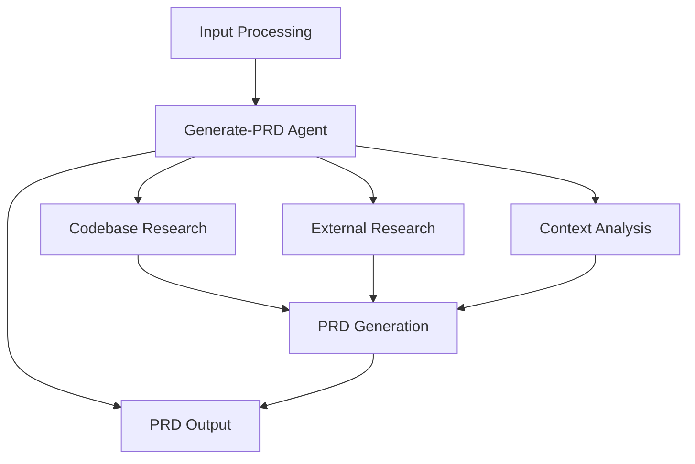

# PRD: Generate-PRD Command Refactoring 

**Project**: Claude Code Mods Enhancement  
**Feature**: Refactor generate-prd command to accept direct problem descriptions  
**Version**: 1.0  
**Date**: 2025-09-04  

## Executive Summary

This PRD outlines the refactoring of the existing `generate-prd` command to accept direct problem descriptions instead of requiring pre-existing brainstorm brief files. This simplification maintains the sophisticated PRD generation capabilities while removing workflow friction.

### Key Changes
- **Input Method**: Change from file path argument to direct problem description
- **Simplified Workflow**: Direct delegation to generate-prd-agent without intermediate agents
- **Maintained Capabilities**: Full research and analysis power of generate-prd-agent preserved
- **Improved Usability**: No file preparation required

### Business Value
- **Reduced Friction**: Users can generate PRDs directly from problem descriptions
- **Better User Experience**: No file preparation required
- **Maintained Quality**: Full research and analysis capabilities preserved
- **Consistency**: Similar interface pattern to other commands

## Problem Statement

The current `generate-prd` command has several limitations:

1. **File Dependency**: Requires pre-existing brainstorm brief files, creating workflow friction
2. **Workflow Complexity**: Users must create files before generating PRDs
3. **Inconsistent UX**: Different interface pattern compared to other commands that accept direct descriptions

## Solution Overview

Refactor the `generate-prd` command to accept direct problem descriptions and delegate directly to the generate-prd-agent:

**Single Phase**: Direct delegation to generate-prd-agent with problem description

This approach leverages the existing sophisticated research and analysis capabilities of the generate-prd-agent while removing workflow friction.

## Technical Architecture Analysis

### Current Implementation

**.claude/commands/code/generate-prd.md** (Current):
```markdown
argument-hint: "brainstorm_brief_file_path"
```
- Simple file path validation
- Direct delegation to generate-prd-agent
- No parallel processing
- No state management

### Target Implementation Pattern

**Simplified Direct Delegation**:
- Direct description argument: `"project/feature description"`
- Single phase: Direct delegation to generate-prd-agent
- No intermediate state management required
- Leverages generate-prd-agent's built-in research capabilities

### Agent Analysis

**.claude/agents/code/generate-prd-agent.md** (Keep As-Is):
- Already sophisticated with comprehensive research capabilities
- Phase-based implementation planning with dependency mapping
- Multi-agent coordination strategies
- Quality scoring and validation
- Should remain unchanged - this is the endpoint, not the problem

## Implementation Approach

### Pseudocode Overview

```markdown
# New generate-prd command flow

## Single Phase: Direct PRD Generation
1. Parse direct description argument
2. Launch generate-prd-agent with Task tool
3. Pass problem description directly to agent
4. Agent conducts own research and analysis
5. Validate PRD output
```

### State Management Structure

```
prds/
└── {next_highest_integer}_{feature_name}.md
```

No intermediate state management required - generate-prd-agent handles its own research process internally.

## Phase-Based Implementation Strategy

### Dependency Graph



### Phase 1: Direct PRD Generation

**Goal**: Generate comprehensive PRD directly from problem description  
**Dependencies**: None  
**Estimated Effort**: 1 agent-hour  
**Agent Assignment Strategy**: Single agent (generate-prd-agent)

**Tasks**:
- [ ] **Task 1.1** (Parallelizable: No) - Parse and validate problem description input
- [ ] **Task 1.2** (Parallelizable: No) - Launch generate-prd-agent with problem description
- [ ] **Task 1.3** (Parallelizable: No) - Monitor agent execution for completion
- [ ] **Task 1.4** (Parallelizable: No) - Validate PRD output quality and completeness

**Agent Strategy**:
- Generate-prd-agent handles all research and analysis internally:
  - Codebase analysis using existing search tools
  - External research using web search and documentation tools
  - Context analysis and pattern recognition
  - Phase-based implementation planning
  - Multi-agent coordination strategy design

**Validation Criteria**:
- [ ] Problem description successfully parsed and passed to agent
- [ ] Generate-prd-agent successfully produces comprehensive PRD with score 8+
- [ ] Final PRD saved to `prds/{next_highest_integer}_{feature_name}.md`
- [ ] PRD includes all required sections and quality standards

**Handoff Artifacts**:
- Comprehensive PRD ready for `/execute-prd` command
- Complete implementation strategy with phase-based approach
- Multi-agent coordination plan for implementation

## Implementation Blueprint

### File Modification: .claude/commands/code/generate-prd.md

**Current Structure** (lines to replace):
```markdown
---
description: "Generate comprehensive PRDs with parallelizable phases, dependency mapping, and multi-agent coordination strategy"
argument-hint: "brainstorm_brief_file_path"
allowed-tools: ["Task", "Read"]
---
```

**New Structure**:
```markdown
---
description: "Generate comprehensive PRDs directly from problem descriptions using sophisticated generate-prd-agent"
argument-hint: "problem/feature description"
allowed-tools: ["Task"]
model: claude-opus-4-1-20250805
---

# Direct PRD Generation Workflow

Generate comprehensive PRD for: $ARGUMENTS

## Workflow Execution Instructions

This command provides a streamlined path from problem description to comprehensive PRD by leveraging the sophisticated research and analysis capabilities of the generate-prd-agent.

### Single Phase: PRD Generation

1. **Input Processing**: Parse and validate the problem/feature description
2. **Agent Delegation**: Invoke the generate-prd-agent with the Task tool
3. **Context**: Pass the problem description directly to the agent: "$ARGUMENTS"
4. **Instructions for generate-prd-agent**:
   - Parse the problem description and understand the feature requirements
   - Conduct deep codebase analysis and external research as needed
   - Research existing patterns and implementation approaches
   - Create phase-based implementation plans with dependency mapping
   - Design multi-agent coordination strategies for implementation
   - Generate comprehensive PRD optimized for one-pass implementation success
   - Save as: `prds/{next_highest_integer}_{feature_name}.md`
   - Score the PRD for implementation confidence (target: 8+)

## Agent Capabilities Leveraged

The generate-prd-agent will autonomously:
- **Research & Analysis**: Conduct thorough codebase analysis and external research
- **Pattern Recognition**: Identify existing patterns and architectural decisions
- **Context Gathering**: Use available tools to gather necessary technical context
- **Quality Assurance**: Apply comprehensive validation checkpoints
- **Strategic Planning**: Design phase-based implementation with multi-agent coordination

## Expected Output

**Comprehensive PRD**: Complete PRD saved to `prds/{next_highest_integer}_{feature_name}.md` with:
- Detailed problem analysis and solution approach
- Phase-based implementation strategy
- Multi-agent coordination plan
- Technical context and integration points
- Quality validation criteria
- Implementation confidence score of 8+

## Success Criteria
- Problem description successfully processed and understood
- Generate-prd-agent produces comprehensive PRD with score 8+
- PRD ready for immediate `/execute-prd` execution
- All research and analysis completed autonomously by the agent
```

### Error Handling Strategy

**Single Phase Error Handling**:
- If input parsing fails: Provide clear error messages and request clarification
- If generate-prd-agent fails: Provide detailed error context and retry instructions
- If PRD generation is incomplete: Restart with refined problem description

**Recovery Procedures**:
- Input validation before agent delegation
- Clear user feedback on execution progress and any issues
- Detailed error reporting if PRD generation fails

## Quality Assurance

### Validation Checkpoints

**Input Validation**:
- [ ] Problem description successfully parsed and understood
- [ ] Generate-prd-agent launches successfully using Task tool
- [ ] Agent receives clear problem context

**Output Validation**:
- [ ] Generate-prd-agent produces comprehensive PRD
- [ ] Final PRD meets quality standards (score 8+)
- [ ] PRD saved to correct location with proper numbering
- [ ] All required PRD sections included

**Integration Validation**:
- [ ] Command accepts direct description arguments correctly
- [ ] Execution completes within expected timeframe
- [ ] Output PRD is immediately ready for `/execute-prd` command
- [ ] Agent autonomously handles all research and analysis

## Implementation Anti-Patterns to Avoid

- Don't modify generate-prd-agent interface - maintain compatibility
- Don't add unnecessary complexity - keep delegation simple and direct
- Don't lose problem context - ensure clear description passes to agent
- Don't duplicate logic - leverage agent's built-in research capabilities
- Don't skip validation - ensure quality output before completion

## Agent Delegation Strategy

### Single Agent Approach
- **Direct Delegation**: Problem description passed directly to generate-prd-agent
- **Autonomous Operation**: Agent handles all research and analysis internally
- **Self-Contained**: No coordination required with other agents

### Task Tool Usage
- **Simple Invocation**: Single Task tool call to generate-prd-agent
- **Clear Context**: Problem description provided as direct input
- **Quality Output**: Agent responsible for comprehensive PRD generation

### Simplicity Benefits
- **Reduced Complexity**: No synchronization or coordination required
- **Reliable Execution**: Single point of failure with established agent
- **Clear Interface**: Direct problem-to-PRD workflow

## Success Metrics

### Technical Success Metrics
- **Execution Time**: Streamlined single-agent execution
- **Output Quality**: Generate-prd-agent confidence score averages 8.5+
- **Success Rate**: 95%+ successful PRD generation from direct descriptions
- **Error Recovery**: Clear error reporting and retry guidance

### User Experience Metrics  
- **Ease of Use**: Direct description input vs file path requirement
- **Workflow Simplicity**: Single command execution vs multi-step process
- **Implementation Readiness**: 90%+ of PRDs successfully execute via `/execute-prd`

### Implementation Quality Metrics
- **Code Reuse**: 100% reuse of existing generate-prd-agent without modification
- **Simplicity**: Minimal complexity while maintaining full functionality
- **Reliability**: Single agent execution reduces potential failure points
- **Documentation**: Complete integration with existing command ecosystem

## Confidence Score

**Implementation Confidence**: 9/10

**Reasoning**: 
- **High Confidence Factors**:
  - Simple interface change from file path to direct description
  - Existing generate-prd-agent remains completely unchanged (low risk)
  - Direct delegation approach is straightforward and proven
  - All research capabilities already built into generate-prd-agent
  - Minimal complexity reduces potential failure points

- **Risk Mitigation**:
  - No changes to sophisticated generate-prd-agent (zero risk)
  - Simple Task tool delegation follows established patterns
  - No state management complexity to introduce bugs
  - Single agent execution eliminates coordination risks

- **Success Enablers**:
  - Generate-prd-agent already has comprehensive research capabilities
  - Quality assurance through existing agent scoring system
  - Simple input validation and error handling
  - Leverages all existing agent sophistication without modification

The high confidence score reflects the fact that this is primarily a simple interface change that leverages existing, well-tested agent capabilities rather than adding architectural complexity.